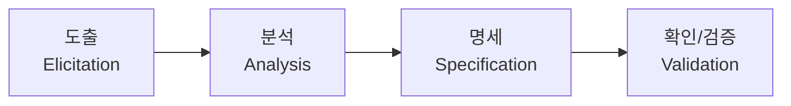
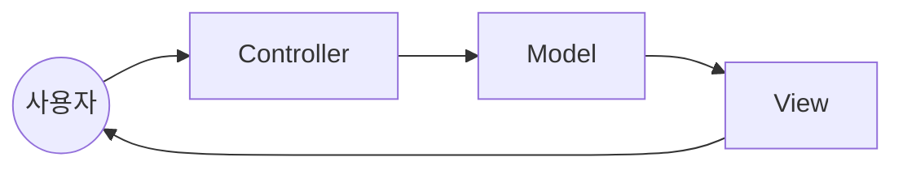
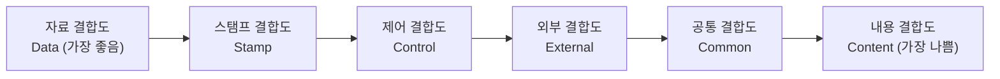
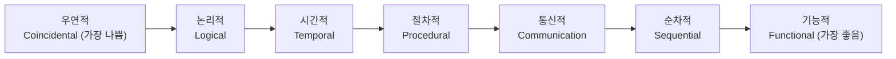
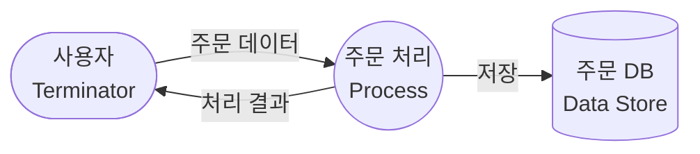
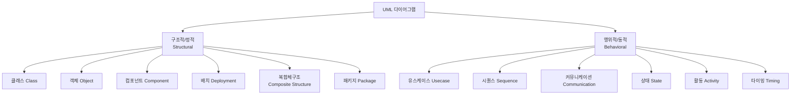

정보처리기사 필기 준비를 시작한다. 5과목(소프트웨어 설계 → 소프트웨어 개발 → 데이터베이스 구축 → 프로그래밍 언어 활용 → 정보시스템 구축관리) 순서대로 정리해 나갈 예정이고, 이번 글은 **1과목 소프트웨어 설계**다. 직접 정리한 초안에 자주 출제되는 항목(UI 설계, 아키텍처 패턴, 요구사항 도출기법, UML 관계 등)을 보강했다.

> 🔥 표시는 시험에 반복 출제되는 **필수 암기 포인트**, ⚠️ 표시는 **헷갈리기 쉬운 함정**이다.
{: .prompt-info }

---

## 1. 객체지향 기본 개념

### 1-1. 모듈 / 객체 / 클래스

| 용어 | 정의 |
|---|---|
| **Module (모듈)** | 모듈화를 통해 분리된 시스템의 각 기능. 서브루틴, 서브시스템, 프로그램 내 작업 단위 등과 같은 의미로 사용 |
| **Object (객체)** | 데이터 속성과 이를 처리하는 연산(메소드)을 결합시킨 실체. 데이터와 메소드를 묶어 놓은 하나의 소프트웨어 모듈 |
| **Class (클래스)** | 공통된 속성과 연산(행위)을 갖는 객체의 집합. 객체의 일반적인 타입이자 데이터를 추상화하는 단위 |

### 1-2. 객체지향의 4대 특징

> 🔥 "다음 중 객체지향의 특징이 아닌 것은?" 유형으로 매회 출제된다.
{: .prompt-tip }

| 특징 | 설명 |
|---|---|
| **캡슐화 (Encapsulation)** | 데이터와 메소드를 하나로 묶고 외부에는 인터페이스만 노출 → 정보 은닉(Information Hiding) 실현 |
| **상속 (Inheritance)** | 상위 클래스의 속성과 연산을 하위 클래스가 물려받아 재사용 |
| **다형성 (Polymorphism)** | 동일한 메시지에 대해 객체마다 다르게 반응 (오버로딩/오버라이딩) |
| **추상화 (Abstraction)** | 공통 속성이나 기능을 묶어 이름을 붙이는 것 (클래스 도출의 근간) |

### 1-3. 연관성(Relationship)

두 개 이상의 객체(클래스)들이 상호 참조하는 관계.

| 관계 표현 | 명칭 | 의미 |
|---|---|---|
| Is member of | **연관화 (Association)** | 2개 이상의 객체가 상호 관련되어 있음 |
| Is instance of | **분류화 (Classification)** | 동일한 형의 특성을 갖는 객체들을 모아 구성 |
| Is part of | **집단화 (Aggregation)** | 관련 있는 객체들을 묶어 하나의 상위 객체를 구성 |
| Is a | **일반화(Generalization) / 특수화(Specialization)** | 상위-하위 개념으로 구조화 |

> 🔥 "Is member of → 연관화", "Is part of → 집단화", "Is a → 일반화"는 표현-용어 매칭 문제로 자주 나온다. 그대로 암기.
{: .prompt-tip }

---

## 2. 요구사항 확인

### 2-1. 요구공학 프로세스

### 2-2. 요구사항 도출 기법

| 기법 | 설명 |
|---|---|
| 인터뷰 | 이해관계자와 직접 대화하며 요구사항 수집 |
| 브레인스토밍 | 자유롭게 아이디어를 제시하고 취합 |
| 델파이 기법 | 전문가 집단에게 익명으로 여러 차례 설문 후 의견 수렴 |
| 워크숍 (JAD) | 이해관계자가 한자리에 모여 집중적으로 요구사항 정의 |
| 프로토타이핑 | 시제품을 만들어 보여주고 피드백을 받아 요구사항 구체화 |
| 유스케이스 | 사용자 관점의 시나리오로 기능 요구사항 도출 |

### 2-3. 요구사항 명세 기법

| 구분 | 정형 명세 기법 | 비정형 명세 기법 |
|---|---|---|
| 기반 | 수학적 기호/모델 기반 | 자연어 기반 |
| 특징 | 정확하고 명세가 간결, 표현력 높지만 이해에 전문성 필요 | 이해하기 쉬우나 모호함·불완전성 발생 가능 |
| 예 | Z, VDM, Petri-net | 상태/흐름 중심 명세 (E-R 다이어그램, 상태 전이도 등) |

### 2-4. 기능 요구사항 vs 비기능 요구사항

| 예시 | 구분 |
|---|---|
| 은행의 조회·입금·출금·이체가 '어떻게 수행'되는지 | **기능 요구사항** — 시스템이 수행해야 하는 기능 자체 |
| 처리 속도·처리량 등 성능 요구사항 | **비기능 요구사항** |
| 보안 및 접근 통제 요구사항 | **비기능 요구사항** |
| "모든 화면은 3초 안에 사용자에게 보여야 한다" | **비기능 요구사항** — 성능(응답시간) 제약 |

> ⚠️ "무엇을(What) 하는가"는 기능, "얼마나 잘(How well)"은 비기능. 숫자(초, %, 건/초)가 들어가면 십중팔구 비기능 요구사항이다.
{: .prompt-warning }

### 2-5. 요구사항 검토 방법

| 방법 | 설명 |
|---|---|
| **동료 검토 (Peer Review)** | 작성자가 명세서 내용을 직접 설명하고 동료들이 들으면서 결함을 찾는 방식 |
| **워크스루 (Walk Through)** | 검토 회의 전 명세서를 미리 배포해 사전 검토한 뒤, 짧은 회의로 결함을 발견 |
| **인스펙션 (Inspection)** | 작성자를 제외한 검토 전문가들이 명세서를 확인하며 결함을 발견 |

---

## 3. 화면(UI) 설계

### 3-1. UI 설계 원칙

> 🔥 4대 원칙(직관성·유효성·학습성·유연성)은 정의와 함께 세트로 암기.
{: .prompt-tip }

| 원칙 | 설명 |
|---|---|
| **직관성** | 누구나 쉽게 이해하고 사용할 수 있어야 함 |
| **유효성** | 정확하고 완벽하게 사용자의 목표가 달성될 수 있도록 도와야 함 |
| **학습성** | 초보자와 숙련자 모두가 쉽게 배우고 사용할 수 있어야 함 |
| **유연성** | 사용자의 요구를 최대한 수용하며 오류를 최소화해야 함 |

### 3-2. UI 설계 도구 비교

| 도구 | 설명 |
|---|---|
| **와이어프레임 (Wireframe)** | 화면의 레이아웃을 골격 수준으로 단순하게 배치한 것 |
| **목업 (Mockup)** | 실제 화면과 유사하게 만든 정적인 시각적 모형 |
| **스토리보드 (Storyboard)** | 와이어프레임에 화면 간 전환 흐름, 상호작용, 정책 등을 포함해 설명한 문서 |
| **프로토타입 (Prototype)** | 실제 동작 가능한 형태로 구현한 시제품 |
| **유스케이스 (Usecase)** | 사용자 관점에서 시스템과의 상호작용을 시나리오로 표현 |

---

## 4. 애플리케이션 설계

### 4-1. 소프트웨어 설계 원칙

| 원칙 | 설명 |
|---|---|
| **모듈화 (Modularity)** | 시스템을 독립적인 모듈 단위로 분리 → 결합도는 낮게, 응집도는 높게 |
| **추상화 (Abstraction)** | 기능적 추상화(무엇을 하는지만 정의), 제어 추상화(제어 흐름을 상세 없이 표현), 자료 추상화(자료를 상세 없이 표현) |
| **정보 은닉 (Information Hiding)** | 모듈 내부의 정보와 구현 세부사항을 외부에 감춤 |
| **단계적 분해 (Stepwise Refinement)** | 큰 문제를 작은 단위로 나누어 순차적으로 상세화 |

### 4-2. 소프트웨어 아키텍처 패턴

> 🔥 이름-특징 매칭 문제로 출제 빈도가 높다.
{: .prompt-tip }

| 패턴 | 특징 |
|---|---|
| **계층화 패턴 (Layered)** | 시스템을 계층으로 나누어 각 계층이 인접 계층과만 상호작용 (OSI 7계층, MVC 등) |
| **클라이언트-서버 패턴** | 하나의 서버와 다수의 클라이언트로 구성, 서버가 서비스를 제공 |
| **파이프-필터 패턴 (Pipe-Filter)** | 데이터 스트림을 필터가 순차적으로 처리, 각 필터는 파이프로 연결 (컴파일러 등) |
| **MVC 패턴** | Model(데이터) - View(화면) - Controller(제어)로 역할 분리 |
| **브로커 패턴 (Broker)** | 분산 환경에서 클라이언트와 서버 컴포넌트 간 통신을 브로커가 중개 (CORBA 등) |
| **마스터-슬레이브 패턴** | 마스터가 작업을 분배하고 슬레이브들이 병렬 처리 후 결과를 반환 |

### 4-3. 결합도 (Coupling)

서로 다른 모듈 간 상호 의존하는 정도. **낮을수록 좋은 설계**다.

| 결합도 | 설명 |
|---|---|
| **자료 결합도 (Data)** | 모듈 간 인터페이스가 자료 요소로만 구성 |
| **스탬프(검인) 결합도 (Stamp)** | 배열이나 레코드 등 자료 구조가 인터페이스로 전달 |
| **제어 결합도 (Control)** | 제어 신호나 제어 요소를 전달해 다른 모듈의 논리적 흐름을 제어 |
| **외부 결합도 (External)** | 한 모듈에서 외부로 선언한 데이터(변수)를 다른 모듈이 참조 |
| **공통(공유) 결합도 (Common)** | 공유되는 공통 데이터 영역을 여러 모듈이 사용 |
| **내용 결합도 (Content)** | 한 모듈이 다른 모듈의 내부 기능·자료를 직접 참조·수정 |

> 🔥 암기법: **"자스제외공내"** (자료→스탬프→제어→외부→공통→내용, 낮음→높음)
{: .prompt-tip }

### 4-4. 응집도 (Cohesion)

모듈 내부 구성 요소 간의 밀접한 관계 정도. **높을수록 좋은 설계**다.

| 응집도 | 설명 |
|---|---|
| **기능적 응집도** | 모듈 내부의 모든 기능이 단일한 목적을 위해 수행 |
| **순차적 응집도** | 한 활동의 출력값을 다른 활동이 입력으로 사용 |
| **통신적(교환적) 응집도** | 동일한 입력·출력을 사용하는 서로 다른 기능들이 모여 있음 |
| **절차적 응집도** | 여러 관련 기능을 모듈 안에서 순차적으로 수행 |
| **시간적 응집도** | 연관성보다는 특정 시점에 처리되어야 하는 활동들을 한 모듈에 모음 |
| **논리적 응집도** | 유사한 성격이나 형태로 분류되는 처리 요소들을 한 모듈에서 처리 |
| **우연적 응집도** | 모듈 내부 구성 요소들 사이에 연관이 없음 |

> 🔥 암기법: **"우논시절통순기"** (우연적→논리적→시간적→절차적→통신적→순차적→기능적, 낮음→높음)
{: .prompt-tip }

### 4-5. GoF 디자인 패턴 (23가지)

| 분류 | 패턴 |
|---|---|
| **생성 패턴 (5)** | 추상 팩토리, 빌더, 팩토리 메소드, 프로토타입, 싱글톤 |
| **구조 패턴 (7)** | 어댑터, 브리지, 컴포지트, 데코레이터, 퍼사드, 플라이웨이트, 프록시 |
| **행위 패턴 (11)** | 커맨드, 책임 연쇄(Chain of Responsibility), 인터프리터, 반복자(Iterator), 중재자(Mediator), 메멘토, 옵서버, 상태, 전략(Strategy), 템플릿 메소드, 방문자(Visitor) |

**디자인 패턴 사용의 장점**
- 소프트웨어 구조 파악이 용이
- 객체지향 설계 및 구현의 생산성을 높이는 데 적합
- 재사용을 위한 개발 시간이 단축됨
- 절차형 언어보다 객체지향 언어와 함께 이용될 때 효율이 극대화됨

### 4-6. 객체지향 설계 원칙 (SOLID)

| 원칙 | 내용 |
|---|---|
| **SRP** (단일 책임 원칙) | 객체는 단 하나의 책임만 가져야 함 → 응집도는 높게, 결합도는 낮게 |
| **OCP** (개방 폐쇄 원칙) | 기존 코드를 변경하지 않고 기능을 추가할 수 있도록 설계 (공통 인터페이스로 캡슐화) |
| **LSP** (리스코프 치환 원칙, Liskov Substitution Principle) | 자식 클래스는 최소한 부모 클래스가 가능한 행위를 수행할 수 있어야 함 |
| **ISP** (인터페이스 분리 원칙) | 사용하지 않는 인터페이스와 의존 관계를 맺지 않아야 함 |
| **DIP** (의존 역전 원칙) | 추상성이 낮은 클래스보다 추상성이 높은 클래스와 의존 관계를 맺어야 함 (인터페이스 활용으로 준수) |

> ⚠️ SRP는 **객체**가 갖는 하나의 책임, ISP는 **인터페이스**가 갖는 하나의 책임 — 주어가 다르다는 점으로 구분.
{: .prompt-warning }

### 4-7. 상위 설계 vs 하위 설계

| 구분 | 상위 설계 | 하위 설계 |
|---|---|---|
| 다른 이름 | 아키텍처 설계, 예비 설계 | 모듈 설계, 상세 설계 |
| 범위 | 시스템 수준 컴포넌트 간 관계·전체 구조 | 각 구성요소의 내부 구조·행위·알고리즘 |
| 종류 | 구조 설계, DB 설계, 인터페이스 정의 및 설계 | 컴포넌트 설계, 자료구조 설계, 알고리즘 설계 |

---

## 5. 인터페이스 설계

### 5-1. 미들웨어의 종류

| 미들웨어 | 설명 |
|---|---|
| **DB** | DB 벤더가 제공, 클라이언트에서 원격 데이터베이스와 연결 |
| **RPC** | 원격 프로시저를 로컬 프로시저처럼 호출 |
| **MOM** (Message Oriented Middleware) | 메시지 기반 비동기 전달 → 실시간 대응에는 부적합 |
| **TP-Monitor** | 항공/철도 예약 등 온라인 트랜잭션 처리를 감시·제어 |
| **ORB** (Object Request Broker) | 객체지향 미들웨어, 코바(CORBA) 표준 스펙 구현 |
| **WAS** (Web Application Server) | 동적 콘텐츠 처리를 위한 미들웨어 |

### 5-2. EAI (Enterprise Application Integration) 구축 유형

| 유형 | 특징 |
|---|---|
| **Point-to-Point** | 시스템 간 1:1로 직접 연결. 구성은 단순하지만 시스템이 늘어날수록 연결이 기하급수적으로 증가 |
| **Hub & Spoke** | 중앙 허브가 모든 연계를 관리. 확장·유지보수 용이, 허브 장애 시 전체 영향 |
| **Message Bus (ESB)** | 미들웨어(버스)를 통해 메시지 전송, 대용량 처리에 적합 |
| **Hybrid** | Hub & Spoke와 Message Bus를 혼합, 그룹 내에서는 허브, 그룹 간에는 버스 사용 |

> 🔥 EAI 유형은 정보시스템 구축관리(5과목)와도 겹치는 단골 주제. 그림으로 형태를 함께 기억해두면 좋다.
{: .prompt-tip }

---

## 6. 시스템 분석·설계 도구

### 6-1. 자료흐름도 (DFD, Data Flow Diagram)

- 자료흐름 그래프 또는 버블 차트라고도 함
- 구조적 분석 기법에 이용, 시간 흐름은 명확히 표현하지 못함
- 화살표, 원, 사각형, 직선(단선/이중선)으로 표시

| 구성요소 | 의미 |
|---|---|
| 프로세스 (Process) | 입력을 출력으로 변환하는 처리 |
| 자료 흐름 (Data Flow) | 데이터의 이동 |
| 자료 저장소 (Data Store) | 데이터가 저장되는 곳 |
| 단말 (Terminator) | 시스템 외부의 발신자/수신자 |

**작성 지침**
- 자료 흐름은 처리(Process)를 거쳐 변환될 때마다 새로운 이름을 부여
- 어떤 처리가 출력 자료를 산출하려면 반드시 입력 자료가 발생해야 함
- 자료 저장소로의 입력 화살표는 데이터의 입력·수정을 의미 → **입력 화살표가 있다고 반드시 출력 화살표가 있어야 하는 것은 아님**
- 상위 단계의 처리와 하위 자료흐름도의 자료 흐름은 서로 일치해야 함

### 6-2. HIPO (Hierarchy plus Input-Process-Output)

- 시스템의 기능을 계층적으로 표현하면서, 각 기능별 입력·처리·출력을 명세하는 문서화 기법
- 가시적 도표(계층 구조), 총괄적 도표(전체 개요), 상세 도표(입력-처리-출력 상세)로 구성
- 하향식 소프트웨어 개발을 위한 문서화 도구로 사용됨

### 6-3. N-S 차트 (Nassi-Schneiderman Chart)

- 논리의 기술에 중점을 둔 도형식 표현 방법, 순서도의 화살표(제어 흐름) 대신 사각형 박스를 이용
- 순차·선택·반복 등 제어 구조를 박스 안에 중첩해서 표현
- GOTO 등 임의 분기가 없어 프로그램 검토가 쉽고, 화살표가 없어 논리 흐름 파악이 명확

> ⚠️ HIPO와 N-S 차트는 이름과 용도를 바꿔서 헷갈리게 내는 문제가 많다. **HIPO=계층+입출력 문서화**, **N-S=제어 논리를 박스로 표현**으로 구분.
{: .prompt-warning }

### 6-4. CASE (Computer-Aided Software Engineering)

**주요 기능**
- S/W 라이프 사이클 전 단계의 연결
- 그래픽 지원
- 다양한 소프트웨어 개발 모형 지원

**원천 기술**
- 구조적 기법, 프로토타이핑 기술, 정보 저장소 기술, 응용 프로그래밍 기술, 분산 처리 기술

### 6-5. FEP (Front End Processor, 전위처리기)

입력되는 데이터를 컴퓨터의 프로세서가 처리하기 전에 미리 처리하여, 프로세서의 처리 시간을 줄여주는 프로그램/하드웨어.

### 6-6. DBMS 분석 시 고려사항

가용성, 성능, 기술 지원, 상호 호환성, 구축 비용

### 6-7. 시스템 구성 요소

Input(입력), Process(처리), Output(출력), Control(제어), Feedback(피드백)

---

## 7. UML (Unified Modeling Language)

객체지향 소프트웨어 개발 과정에서 산출물을 명세화·시각화·문서화할 때 사용되는, 모델링 기술과 방법론을 통합한 표준 범용 모델링 언어.

**구성 요소**: 사물(Things), 관계(Relationship), 다이어그램(Diagram)

### 7-1. UML 다이어그램 분류

- **시퀀스(Sequence) 다이어그램 구성 요소**: 액터, 객체, 생명선, 메시지, 실행 상자(활성화 박스)

### 7-2. UML 관계 유형

> 🔥 클래스 다이어그램에서 화살표 모양과 관계 이름을 매칭하는 문제가 자주 나온다.
{: .prompt-tip }

| 관계 | 의미 |
|---|---|
| **연관 (Association)** | 클래스들이 개념적으로 서로 연결됨 |
| **집합 (Aggregation)** | 전체-부분 관계이지만, 부분이 전체와 독립적으로 존재 가능 (약한 소유) |
| **합성 (Composition)** | 전체-부분 관계이며, 부분이 전체에 종속되어 생명주기를 함께함 (강한 소유) |
| **일반화 (Generalization)** | 상속 관계 (is-a) |
| **의존 (Dependency)** | 한 클래스가 다른 클래스를 일시적으로 사용 |
| **실체화 (Realization)** | 인터페이스와 이를 구현하는 클래스 간의 관계 |

---

## 8. 객체지향 분석 방법론

객체지향 분석의 주요 목적은 클래스를 식별하고, 객체를 그 클래스로부터 인스턴스화하는 것이다.

- 동적 모델링 기법이 사용될 수 있음
- 순차적 처리가 아니라 부품을 조립하듯 클래스를 조립 → 상향식·하향식 모두 사용 가능
- 데이터와 행위를 하나로 묶어 객체를 정의하고 추상화하는 작업
- 코드 재사용에 의한 생산성 향상, 요구 변경에 대한 쉬운 대응이 가능

| 방법론 | 특징 |
|---|---|
| **럼바우 (Rumbaugh)** | 가장 일반적으로 사용. 분석 활동을 **객체 모델링**(정보 모델링, 객체 다이어그램) · **동적 모델링**(상태 다이어그램, 시간 흐름에 따른 제어 흐름/상호작용) · **기능 모델링**(DFD 이용, 프로세스 간 자료 흐름 중심)으로 나누어 수행 |
| **부치 (Booch)** | 미시적 개발 프로세스와 거시적 개발 프로세스를 모두 사용. 클래스·객체를 분석·식별하고 속성과 연산을 정의 |
| **야콥슨 (Jacobson)** | Use Case를 이용해 시스템의 요구사항을 파악 |
| **Coad와 Yourdon** | E-R 다이어그램을 사용해 객체의 행위를 모델링. 개체 식별 → 구조 식별 → 주제 정의 → 속성과 인스턴스 연결 정의 → 연산과 메시지 연결 정의 순으로 진행 |
| **Wirfs-Brock** | 분석과 설계 간의 구분이 없음. 고객 명세서를 평가해 설계 작업까지 연속적으로 수행 |

---

## 9. 애자일 개발 방법론

애자일은 특정 개발 방법론이 아니라, 좋은 것을 빠르고 낭비 없게 만들기 위해 **고객과의 소통**에 초점을 맞춘 방법론을 통칭한다. 대표적으로 스크럼, 익스트림 프로그래밍(XP), 기능 주도 개발(FDD), 칸반(Kanban), Lean이 있다.

### 9-1. 스크럼 (Scrum)

| 구성 요소 | 설명 |
|---|---|
| 제품 책임자 (Product Owner) | 제품 백로그의 우선순위를 결정 |
| 스크럼 마스터 (Scrum Master) | 팀이 스크럼 프로세스를 잘 따르도록 지원 |
| 제품 백로그 (Product Backlog) | 개발할 요구사항 목록 |
| 스프린트 (Sprint) | 약 2~4주의 짧은 개발 주기. 반복 수행으로 품질 향상 |
| 스프린트 계획 회의 | 이번 스프린트에서 수행할 백로그 항목을 선정 |
| 일일 스크럼 회의 (Daily Scrum) | 매일 짧게 진행 상황을 공유하는 회의 |
| 스프린트 검토 (Sprint Review) | 스프린트 결과물을 이해관계자에게 시연 |
| 스프린트 회고 (Retrospective) | 스프린트 진행 방식을 되돌아보고 개선점 도출 |
| 번다운 차트 (Burndown Chart) | 스프린트가 계획대로 진행되는지, 팀 차원의 조정이 필요한지 파악할 수 있게 해주는 진행 상황 시각화 도구 |

> 🔥 **속도 (Velocity)**: 한 번의 스프린트에서 한 팀이 소화할 수 있는 제품 백로그의 양에 대한 추정치.
{: .prompt-tip }

### 9-2. 익스트림 프로그래밍 (eXtreme Programming, XP)

- 대표적인 애자일 방법론 유형. 소규모 개발 조직이 불확실하고 변경이 많은 요구를 접했을 때 적절
- 상식적인 원리와 경험을 최대한 끌어올리는 것이 핵심 원리
- 개발 문서보다 소스 코드에 중점을 둔 구체적인 실천 방법 정의
- **5가지 가치**: 용기, 단순성, 의사소통, 피드백, 존중

**주요 실천 방법**
- Pair Programming (짝 프로그래밍)
- Collective Ownership (공통 코드 소유)
- Test Driven Development (테스트 주도 개발)
- Whole Team (전체 팀)
- Continuous Integration (계속적인 통합)
- Design Improvement / Refactoring
- Small Release (소규모 릴리즈)

### 9-3. 그 밖의 애자일 방법론

| 방법론 | 한 줄 특징 |
|---|---|
| **FDD** (기능 주도 개발) | 기능(Feature) 단위로 짧은 반복 주기를 두고 설계·개발 |
| **칸반 (Kanban)** | 작업 흐름을 보드에 시각화하여 진행 중 작업(WIP)을 제한 |
| **Lean** | 낭비 요소를 제거하고 가치 흐름에 집중 (제조업 린 생산방식에서 착안) |

---

다음 편은 **2과목 소프트웨어 개발**(자료구조, 통합구현, 테스트, 형상관리 등)로 이어갈 예정이다.
