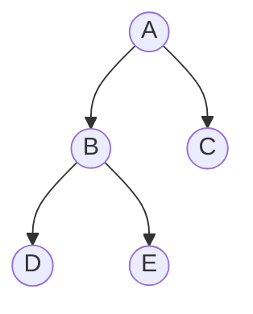
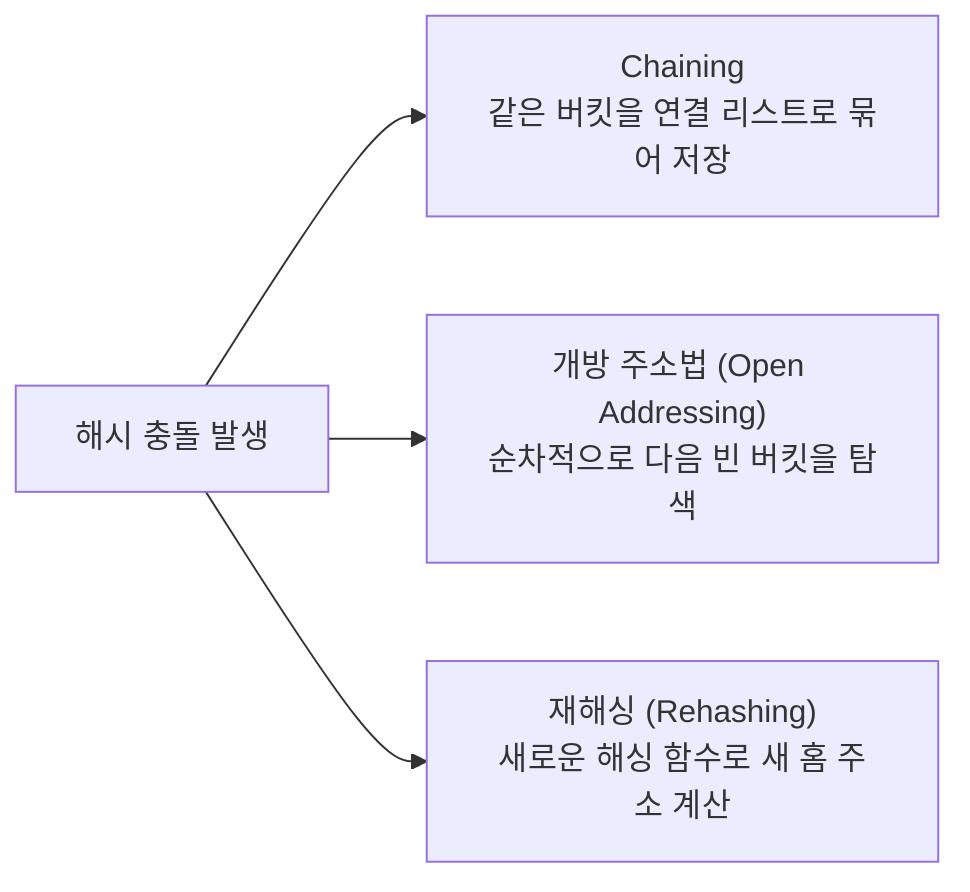
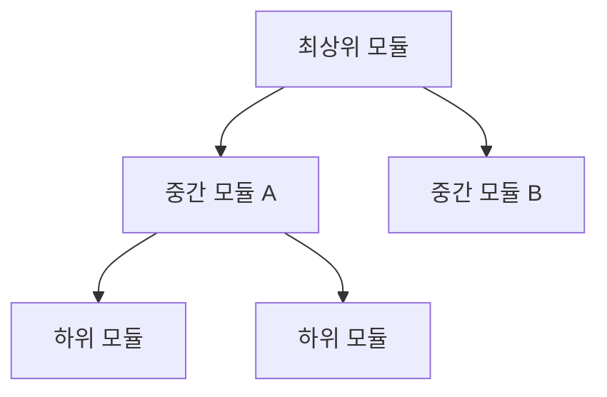

[1과목 소프트웨어 설계](/posts/infoproc-engineer-1-software-design/)에 이어 **2과목 소프트웨어 개발**이다. 직접 정리한 초안(자료구조, 테스트, 해싱, 인터페이스 등)을 기반으로, 시험에 자주 나오지만 초안에는 없던 형상관리·DRM·화이트박스 커버리지 기준 등을 보강했다.

> 🔥 표시는 시험에 반복 출제되는 **필수 암기 포인트**(원본 메모에 `***`로 강조된 항목 포함), ⚠️ 표시는 **헷갈리기 쉬운 함정**이다.
{: .prompt-info }

> 📌 정보처리기사는 문제은행식 시험이라 유사한 기출 문제가 반복 출제되는 경향이 강하다. 최근 5개년 기출을 반복 학습하는 것만으로도 고득점을 노릴 수 있지만, 신기술 트렌드를 반영한 신유형도 간헐적으로 나오니 완전히 손을 놓지는 말 것.
{: .prompt-tip }

---

## 1. 자료구조

### 1-1. 선형 자료구조 — 스택 / 큐 / 덱

| 구조 | 삽입·삭제 방식 | 특징 |
|---|---|---|
| **스택 (Stack)** | 리스트의 **한쪽 끝**으로만 삽입·삭제 모두 이루어짐 | **LIFO** (Last In First Out) |
| **큐 (Queue)** | 한쪽에서는 삽입, 다른 한쪽에서는 삭제 | **FIFO** (First In First Out) |
| **덱 (Deque, Double-Ended Queue)** | 리스트의 **양쪽 끝**에서 삽입·삭제가 모두 가능 | 스택+큐의 특성을 함께 가짐 |

> ⚠️ "삽입·삭제가 양쪽 끝에서 모두 가능"이라는 설명이 나오면 스택이 아니라 **덱**이다. 스택은 한쪽 끝, 큐는 양쪽이지만 삽입/삭제가 각각 고정, 덱만 양쪽 모두 자유롭다.
{: .prompt-warning }

### 1-2. 연결 리스트 (Linked List)

- 자료들을 연속적으로 배열하지 않고 임의의 기억 공간에 저장하되, 노드의 **포인터**를 이용해 순서대로 연결한 자료구조
- 노드의 삽입·삭제가 쉬움
- 포인터를 따라가야 하므로 **선형 리스트(배열)보다 검색 속도가 느림**
- 포인터 저장을 위한 추가 공간 필요
- 중간 노드의 연결이 끊어지면 그 다음 노드를 찾기 어려움

### 1-3. 트리 운행법 (Tree Traversal)

| 운행법 | 순서 | 위 트리의 결과 |
|---|---|---|
| **Preorder (전위)** | Root → Left → Right | A, B, D, E, C |
| **Inorder (중위)** | Left → Root → Right | D, B, E, A, C |
| **Postorder (후위)** | Left → Right → Root | D, E, B, C, A |

> 🔥 이름에 Root의 위치(앞/가운데/뒤)가 그대로 들어있다: Pre**order**=Root가 맨 앞, In**order**=Root가 가운데, Post**order**=Root가 맨 뒤.
{: .prompt-tip }

### 1-4. 해싱 함수 방식

| 방식 | 설명 |
|---|---|
| **제산법 (Division)** | 레코드 키를 해시표 크기로 나눈 **나머지**를 홈 주소로 사용 |
| **폴딩법 (Folding)** | 레코드 키를 여러 부분으로 나누고, 나눈 부분의 각 숫자를 더하거나 XOR한 값을 홈 주소로 사용 |
| **기수 변환법 (Radix Conversion)** | 키의 진수를 다른 진수로 변환시켜, 주소 크기를 초과하는 높은 자릿수를 절단한 뒤 주소 범위에 맞게 조정 |
| **숫자 분석법 (Digit Analysis)** | 키를 구성하는 숫자들의 분포를 분석하여 비교적 고른 자리를 필요한 만큼 선택 |

### 1-5. 해시 충돌(Collision) 해결 방법

> 🔥 원본 메모에서 `***`로 강조된 최우선 암기 항목.
{: .prompt-tip }

| 방법 | 설명 |
|---|---|
| **체이닝 (Chaining)** | 충돌이 발생하면 버킷에 **연결 리스트(Linked List)** 형태로 데이터를 이어 저장 |
| **개방 주소법 (Open Addressing)** | 충돌이 발생하면 **순차적으로 다음 빈 버킷**을 찾아 데이터를 저장 |
| **재해싱 (Rehashing)** | 충돌이 발생하면 **새로운 해싱 함수**로 새로운 홈 주소를 구함 |

---

## 2. 정렬 · 검색 알고리즘

### 2-1. 정렬 알고리즘 시간복잡도

> 🔥 "다음 중 시간복잡도가 다른 것은?" 유형으로 매회 출제. O(n²) 그룹과 O(nlog n) 그룹을 구분해서 암기.
{: .prompt-tip }

| 정렬 | 평균 시간복잡도 | 비고 |
|---|---|---|
| 버블 정렬 (Bubble Sort) | **O(n²)** | 인접한 두 원소를 비교·교환 |
| 선택 정렬 (Selection Sort) | **O(n²)** | 매 회전마다 최솟값을 선택해 배치 |
| 삽입 정렬 (Insertion Sort) | **O(n²)** | 정렬된 부분에 새 원소를 끼워 넣음 |
| 셸 정렬 (Shell Sort) | O(n^1.5) 근처 | 일정 간격(gap)으로 그룹을 나눠 삽입 정렬 반복 |
| **합병 정렬 (Merge Sort)** | **O(N log₂N)** | 분할 정복, 항상 일정한 성능(최악에도 O(n log n)) |
| 퀵 정렬 (Quick Sort) | O(n log n), 최악 O(n²) | 평균은 가장 빠른 편이나 피벗 선택에 따라 최악 발생 |
| 힙 정렬 (Heap Sort) | O(n log n) | 완전 이진 트리(힙) 구조 이용 |

### 2-2. 검색 알고리즘

| 검색 | 전제 조건 | 시간복잡도 |
|---|---|---|
| **이진 검색 (Binary Search)** | 검색 전 **반드시 데이터가 정렬**되어 있어야 함 | O(log n) |
| **선형 검색 (Linear Search)** | 정렬 불필요, 처음부터 끝까지 순서대로 비교 | O(n) |

---

## 3. 알고리즘 설계 기법

| 기법 | 설명 |
|---|---|
| **분할 정복 (Divide and Conquer)** | 큰 문제를 더 작은 문제로 분할하여 각각 해결한 뒤 결합 |
| **동적 계획법 (Dynamic Programming)** | 아래 단계의 간단한 부분 문제부터 해결하며 점차 상위로 나아가는 **상향식** 접근 |
| **탐욕 알고리즘 (Greedy Algorithm)** | 완벽한 해결책 대신, 매 순간 상황에 맞는 최선의 선택을 즉석에서 선택하는 방식 |
| **백트래킹 (Backtracking)** | **깊이 우선 탐색**을 이용해 문제 해결의 모든 가능성을 트리로 구축하며 탐색 |

---

## 4. 자료 구성 단위

작은 단위부터 큰 단위 순서.

| 단위 | 설명 |
|---|---|
| **비트 (Bit)** | 자료 표현의 최소 단위. 0과 1을 표시하는 2진수 1자리 |
| **니블 (Nibble)** | 4개의 비트가 모여 구성. 16진수 1자리 표현에 적합 |
| **바이트 (Byte)** | 문자를 표현하는 최소 단위. 8개의 비트로 구성 |
| **워드 (Word)** | CPU가 한 번에 처리할 수 있는 명령 단위 |
| **필드 (Field)** | 파일 구성의 최소 단위. 의미 있는 정보를 표현하는 최소 단위 |
| **레코드 (Record)** | 하나 이상의 관련된 필드가 모여 구성 |
| **블록 (Block)** | 하나 이상의 논리 레코드가 모여 구성 |
| **파일 (File)** | 프로그램 구성의 기본 단위. 여러 레코드가 모여 구성 |
| **데이터베이스 (Database)** | 여러 개의 관련된 파일의 집합 |

---

## 5. 애플리케이션 테스트

### 5-1. 테스트 종류

| 종류 | 설명 |
|---|---|
| **단위 테스트 (Unit Test)** | 코딩 직후 소프트웨어 설계의 **최소 단위**인 모듈·컴포넌트에 초점을 맞춘 테스트 |
| **통합 테스트 (Integration Test)** | 단위 테스트가 끝난 모듈들을 결합해 하나의 시스템으로 완성시키는 과정의 테스트 |
| **시스템 테스트 (System Test)** | 개발된 소프트웨어가 해당 컴퓨터 시스템에서 완벽하게 수행되는지 점검 |
| **인수 테스트 (Acceptance Test)** | 개발한 소프트웨어가 **사용자의 요구사항**을 충족하는지에 중점을 둔 테스트 |

### 5-2. 단위 테스트 상세

**단위 테스트로 발견할 수 있는 오류**
- 알고리즘 오류에 따른 원치 않는 결과
- 탈출구가 없는 반복문의 사용
- 틀린 계산 수식에 의한 잘못된 결과

**단위 테스트의 종류**

| 종류 | 설명 |
|---|---|
| **구조 기반 테스트** (주로 사용) | 프로그램 **내부 구조 및 복잡도**를 검증하는 화이트박스 테스트 |
| **명세 기반 테스트** | 목적 및 실행 코드 기반의 블랙박스 테스트 |

**화이트박스 테스트 커버리지 기준** (구조 기반 테스트 보강)

| 커버리지 | 설명 |
|---|---|
| 구문 커버리지 (Statement) | 모든 문장을 **최소 1번**은 실행 |
| 분기 커버리지 (Branch/Decision) | 모든 분기(조건문의 참/거짓)를 **최소 1번**씩 실행 |
| 조건 커버리지 (Condition) | 각 개별 조건식이 참/거짓을 **한 번씩** 갖도록 실행 |
| 조건/분기 커버리지 | 조건 커버리지 + 분기 커버리지를 동시에 만족 |

### 5-3. 통합 테스트

시스템을 구성하는 모듈의 **인터페이스와 결합**을 테스트한다.

| 구분 | 하향식 통합 테스트 | 상향식 통합 테스트 |
|---|---|---|
| 방향 | 상위 모듈 → 하위 모듈 | 하위 모듈 → 상위 모듈 |
| 탐색 순서 | 넓이 우선, 깊이 우선 | - |
| 사용 도구 | **스텁 (Stub)** | **클러스터 + 테스트 드라이버 (Driver)** |
| 특징 | 초기부터 사용자에게 시스템 구조를 보여줄 수 있음 | - |

> 🔥 모듈 간 인터페이스와 시스템 동작이 정상적으로 되고 있는지 **빠르게 파악**하고 싶을 때는 **하향식**을 사용한다. 초기부터 구조를 보여줄 수 있기 때문이다.
{: .prompt-tip }

> ⚠️ 하향식은 **스텁(Stub, 하위 모듈 대역)**, 상향식은 **드라이버(Driver, 상위 모듈 대역)**를 사용 — 방향과 대역 이름을 짝지어 헷갈리지 않게 암기.
{: .prompt-warning }

### 5-4. 명세 기반 테스트 (블랙박스 테스트) 기법

> 🔥 원본 메모에서 `***`로 강조된 최우선 암기 항목.
{: .prompt-tip }

| 기법 | 설명 |
|---|---|
| **동치 분할 검사 (Equivalence Partitioning)** | 입력 조건에 중점을 두고, 타당한 값/그렇지 못한 값을 설정해 해당 입력에 맞는 결과가 출력되는지 확인 |
| **경계값 분석 (Boundary Value Analysis)** | 동치 분할을 보완. 입력 조건의 **경계값**에서 오류가 발생할 확률이 높다는 점을 이용해 경계값을 테스트 케이스로 선정 |
| **원인-효과 그래프 검사 (Cause-Effect Graphing)** | 입력 데이터 간의 관계와 출력에 영향을 미치는 상황을 체계적으로 분석해 효용성 높은 테스트 케이스를 선정 |
| **비교 검사 (Comparison Testing)** | 여러 버전의 프로그램에 동일한 테스트 자료를 제공해 동일한 결과가 나오는지 테스트 |

### 5-5. 테스트 오라클 (Test Oracle)

| 오라클 | 설명 |
|---|---|
| **참(True) 오라클** | 모든 테스트 케이스의 입력값에 대해 기대 결과를 제공 → 발생한 **모든 오류를 검출** 가능 |
| **샘플링(Sampling) 오라클** | 특정 몇몇 테스트 케이스의 입력값에 대해서만 기대 결과를 제공 |
| **추정(휴리스틱, Heuristic) 오라클** | 샘플링 오라클을 개선. 특정 케이스는 기대 결과를 제공하고, 나머지는 추정으로 처리 |
| **일관성 검사(Consistent) 오라클** | 애플리케이션 변경 전·후 테스트 케이스의 결과값이 동일한지 확인 |

### 5-6. 알파 테스트 / 베타 테스트

| 구분 | 알파 테스트 | 베타 테스트 (필드 테스트) |
|---|---|---|
| 장소 | **개발자 환경**에서 수행 | **고객의 실제 사용 환경**에 설치하여 수행 |
| 참여자 | 사용자가 개발자와 함께 참여, 통제된 상태로 수행 | **개발자가 없는 상태**에서 고객이 직접 수행 |

### 5-7. 인터페이스 구현 검증 도구

| 도구 | 설명 |
|---|---|
| **STAF** | 서비스 호출, 컴포넌트 재사용 등 다양한 환경을 지원하는 테스트 프레임워크 |
| **watir** | Ruby를 사용하는 애플리케이션 테스트 프레임워크 |
| **xUnit** | NUnit, JUnit 등 다양한 언어를 지원하는 단위 테스트 프레임워크 |
| **FitNesse** | 웹 기반으로 테스트케이스 설계·실행·결과 확인을 지원하는 테스트 프레임워크 |
| **Selenium** | 다양한 브라우저 및 개발 언어를 지원하는 웹 애플리케이션 테스트 프레임워크 |
| **NTAF** (Naver Test Automation Framework) | FitNesse(협업 기능) + STAF(재사용·확장성)를 통합한 NHN(Naver)의 테스트 자동화 프레임워크 |

### 5-8. 테스트 케이스 (자동) 생성 도구

- 자료흐름도
- 기능 테스트
- 랜덤 테스트
- 입력 도메인 분석

### 5-9. 애플리케이션 테스트 관련 용어

| 용어 | 설명 |
|---|---|
| **살충제 패러독스 (Pesticide Paradox)** | 살충제를 지속적으로 뿌리면 벌레가 내성이 생기듯, **동일한 테스트를 반복하면 더 이상 결함이 발견되지 않는** 현상 |
| **파레토 법칙 (Pareto Principle)** | 테스트로 발견된 오류의 **80%는 20%의 모듈**에서 발견된다는 법칙 → 결함 집중(Defect Clustering) |
| **오류-부재의 궤변 (Absence of Errors Fallacy)** | 결함을 모두 제거해도, 사용자의 요구사항을 만족시키지 못하면 그 소프트웨어는 품질이 높다고 할 수 없음 |

---

## 6. 소스 코드 품질 관리

### 6-1. 소스코드 정적 분석 (Static Analysis)

- 소스코드를 **실행시키지 않고** 분석
- 코드에 있는 오류나 잠재적 오류를 찾아내기 위한 활동
- 자료 흐름이나 논리 흐름을 분석해 비정상적인 패턴을 찾을 수 있음
- ⚠️ 하드웨어적인 방법만으로 분석하는 것은 **아님**

### 6-2. 코드 인스펙션 (Code Inspection)

- 결함뿐 아니라 **코딩 표준 준수 여부, 효율성** 등 다른 품질 이슈까지 함께 검사
- 코드 품질 향상 기법 중 하나이며, **정적 테스트**에 가까움
- 표준·명세서에 서술된 내용과 비교해 편차·에러를 식별하기 위한 산출물을 근거로 수행

**인스펙션 프로세스**

**코드 검사 시 발견되는 오류 유형**

| 코드 | 유형 | 설명 |
|---|---|---|
| **DA** | 데이터 오류 | 데이터 유형 정의, 변수 선언, 매개변수 등에서 나타나는 오류 |
| **FN** | 기능 오류 | 서브루틴·블록이 잘못된 것(What)을 수행하는 오류 |
| **LO** | 논리 오류 | 프로그램 수행 중 요구되는 성능을 만족시키지 못하는 오류 |
| **DC** | 문서 오류 | 선언 부분, 잘못되거나 불필요한 주석 등 문서화 관련 오류 |

---

## 7. 소프트웨어 재공학

| 활동 | 설명 |
|---|---|
| **Reverse Engineering (역공학)** | 기존 소프트웨어를 분석해, 소프트웨어 개발 과정과 데이터 처리 과정을 설명하는 분석·설계 정보를 **재발견**하거나 다시 만들어내는 과정 |
| **Restructuring (재구성)** | 기존 소프트웨어 구조를 향상시키기 위해 코드를 재구성. **기능과 외적인 동작은 바뀌지 않음** → 역공학보다 안정성이 높음 |
| **Reengineering (재공학)** | 기존 시스템을 분석·이해해 새로운 형태로 재구축하는 전체 프로세스 (역공학+재구성+순공학 포함) |
| **Forward Engineering (순공학)** | 설계 정보로부터 실제 구현체를 만들어내는, 일반적인 소프트웨어 개발 방향 |

> ⚠️ Restructuring은 **기능 변경이 없다**는 점에서 역공학·재공학과 구분된다. "안정성이 높다"는 표현이 나오면 재구성(Restructuring)이다.
{: .prompt-warning }

---

## 8. 통합구현 · 형상관리

### 8-1. 형상관리 (Software Configuration Management, SCM)

소프트웨어 개발 과정에서 산출물의 변경을 체계적으로 추적·통제하는 활동.

| 활동 | 설명 |
|---|---|
| **형상 식별 (Identification)** | 형상 관리 대상(소스코드, 문서 등)을 식별하고 체계를 부여 |
| **형상 통제 (Control)** | 변경 요청을 검토·승인하고 **버전을 통제** |
| **형상 감사 (Audit)** | 형상 항목이 요구사항에 맞게 구현되었는지 검증 |
| **형상 기록 (Status Accounting)** | 형상 항목의 변경 사항을 기록하고 보고 |

**형상관리 도구**: Git, SVN(Subversion), CVS, RCS

> ⚠️ **Git**은 분산형(Distributed) 버전 관리 시스템으로 로컬에도 전체 저장소 이력을 가지지만, **SVN/CVS**는 중앙집중형(Centralized)으로 중앙 서버에만 전체 이력이 존재한다.
{: .prompt-warning }

### 8-2. 빌드 자동화 도구

| 도구 | 특징 |
|---|---|
| **Ant** | XML 기반 빌드 스크립트, 절차 지향적 |
| **Maven** | `pom.xml` 기반, **의존성 관리**를 자동화 |
| **Gradle** | Groovy/Kotlin DSL 기반, Ant의 유연성 + Maven의 의존성 관리를 결합. **안드로이드 공식 빌드 도구** |

### 8-3. DRM (Digital Rights Management, 디지털 저작권 관리) 구성요소

| 구성요소 | 설명 |
|---|---|
| **콘텐츠 제공자 (Contents Provider)** | 콘텐츠를 제공하는 저작권자 |
| **콘텐츠 분배자 (Contents Distributor)** | 쇼핑몰 등 콘텐츠를 유통하는 곳 |
| **패키저 (Packager)** | 콘텐츠를 암호화된 콘텐츠로 패키징 |
| **보안 컨테이너 (Secure Container)** | 원본을 안전하게 유통하기 위한 컨테이너 |
| **DRM 컨트롤러** | 배포된 콘텐츠의 이용 권한을 통제 |
| **클리어링 하우스 (Clearing House)** | 저작권에 대한 사용료 정산을 담당 |

---

## 9. 인터페이스 구현

### 9-1. 인터페이스 표준 확인

내·외부 모듈 간 데이터 표준을 확인하는 방법은 **인터페이스 기능** / **데이터 인터페이스**, 2가지로 확인 가능하다.

### 9-2. EAI (Enterprise Application Integration) 구축 유형

> 1과목에서도 다룬 내용이지만, 2과목 통합구현·인터페이스 구현에서도 단골로 겹쳐 나온다.
{: .prompt-info }

| 유형 | 특징 |
|---|---|
| **Point to Point** | 가장 기본적인 방식. 애플리케이션을 **1:1로 직접 연결** → 변경·재사용이 어려움 |
| **Hub & Spoke** | 단일 접점인 허브를 통해 데이터 전송. 중앙 집중형, 확장·유지보수 용이 → **허브 장애 시 전체 영향** |
| **Message Bus (ESB 방식)** | 애플리케이션 사이에 미들웨어(버스)를 두어 처리 → 확장성이 뛰어나고 **대용량 처리 가능** |
| **Hybrid** | Hub & Spoke와 Message Bus의 혼합 방식 |

### 9-3. IPSec (IP Security)

- **암호화·복호화가 모두 가능한 양방향** 암호 방식
- 운영 모드는 **Tunnel 모드**와 **Transport 모드**로 분류

| 프로토콜 | 역할 |
|---|---|
| **AH (Authentication Header)** | 발신지 호스트를 **인증**, IP 패킷의 **무결성**을 보장 |
| **ESP (Encapsulating Security Payload)** | 발신지 인증, 데이터 무결성, **기밀성**까지 모두 보장 |

> ⚠️ AH는 인증+무결성까지만, **ESP는 기밀성(암호화)까지** 포함한다는 점이 핵심 구분 포인트.
{: .prompt-warning }

---

## 10. 소프트웨어 품질 표준

| 표준 | 내용 |
|---|---|
| **ISO/IEC 9126** | 소프트웨어 품질 특성과 평가를 위한 표준 지침 |
| **ISO/IEC 12119** | ISO/IEC 9126을 준수한 품질 요구사항 + **테스트 절차**까지 규정 |
| **ISO/IEC 14598** | 소프트웨어 품질의 측정·평가에 필요한 절차 규정 + 개발자·구매자·평가자별 제품 평가 활동 규정 |
| **ISO/IEC 25000 (SQuaRE)** | ISO/IEC 9126을 개정한 **소프트웨어 품질 평가 통합 모델 표준**. 기존 9126과 14598을 통합, 호환성·보안성 강화 |

**ISO/IEC 25000 시리즈 세부 구분**

| 구분 | 내용 |
|---|---|
| **ISO/IEC 2501n** | 소프트웨어의 내부 품질, 외부 품질, 사용 품질에 대한 **품질 모델** |
| **ISO/IEC 2502n** | 내부 측정, 외부 측정, 사용 품질 측정 등 **품질 측정** |

> 🔥 ISO/IEC 25000 = SQuaRE = ISO/IEC 9126 + 14598 통합. 이름과 번호를 세트로 암기.
{: .prompt-tip }

---

다음 편은 **3과목 데이터베이스 구축**(정규화, SQL, 트랜잭션, 회복·병행제어 등)으로 이어갈 예정이다.
