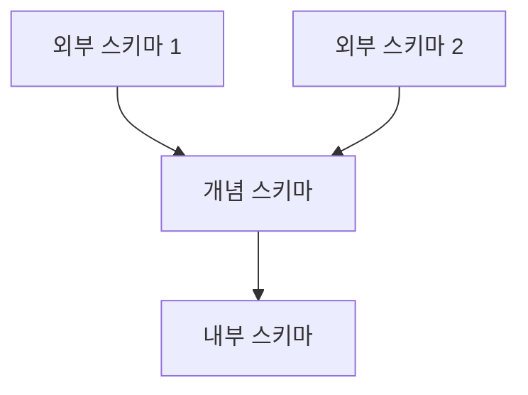
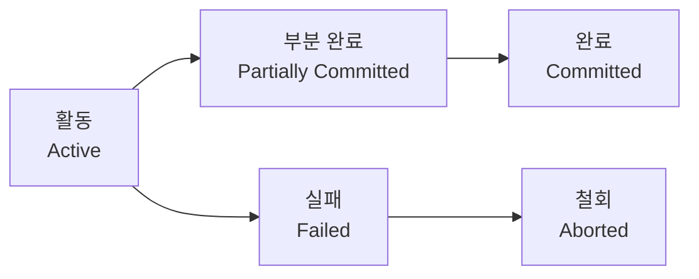

[2과목 소프트웨어 개발](/posts/infoproc-engineer-2-software-development/)에 이어 **3과목 데이터베이스 구축**이다. 직접 정리한 초안(트랜잭션 ACID, 데이터베이스 설계 단계, 키의 종류, 정규화·반정규화, 관계대수·관계해석, 병행제어, 파티셔닝 등)을 기반으로, 시험에 자주 나오지만 초안에는 없던 트랜잭션 상태·격리 수준, 릴레이션 구성요소, 함수 종속, 데이터 사전, 무결성 제약조건, 회복 기법, 로킹 단위, 교착상태 해결법, SQL 기본 문법, 인덱스·뷰 등을 최대한 보강했다.

> 🔥 표시는 시험에 반복 출제되는 **필수 암기 포인트**, ⚠️ 표시는 **헷갈리기 쉬운 함정**이다.
{: .prompt-info }

---

## 1. 데이터베이스 설계

### 1-1. 설계 단계


| 단계 | 주요 활동 | 산출물 |
|---|---|---|
| **개념적 설계** | 트랜잭션 모델링, VIEW 통합 및 애트리뷰트 합성 고려. **DB 종류(DBMS)와 무관**하게 진행 | E-R 다이어그램 |
| **논리적 설계** | 트랜잭션 인터페이스 설계(사용자 입장에서 편리하도록), 목표 DBMS에 맞는 논리적 스키마 설계, 논리적 데이터베이스 구조로 매핑, **스키마의 평가 및 정제**, **정규화 수행** | 테이블(관계형 DB 기준) |
| **물리적 설계** | 트랜잭션 처리량·응답시간·디스크 용량 등을 고려, 저장 레코드의 형식·순서·접근 경로 결정 | 저장 구조, 접근 경로 |

> ⚠️ "스키마의 평가 및 정제"와 "정규화"는 물리적 설계가 아니라 **논리적 설계** 단계의 활동이다. 물리적 설계와 헷갈리지 않도록 주의.
{: .prompt-warning }

### 1-2. 스키마의 3단계 구조



스키마(Schema)는 데이터베이스의 구조와 제약조건에 관한 전반적인 명세를 기술한 메타데이터의 집합이다.

| 스키마 | 설명 |
|---|---|
| **외부 스키마 (External)** | 사용자·응용 프로그래머 개인의 입장에서 필요로 하는 데이터베이스의 논리적 구조 |
| **개념 스키마 (Conceptual)** | 조직 전체 관점의 통합된 논리적 구조. 개체 간의 관계와 제약조건, 접근 권한·보안·무결성 규칙을 정의 |
| **내부 스키마 (Internal)** | 물리적 저장 장치 입장에서 본 DB 구조. 레코드 형식, 저장 데이터 항목의 표현 방법, 내부 레코드의 물리적 순서 등을 정의 |

> 🔥 개념 스키마는 조직 전체에 걸쳐 **오직 1개만 존재**한다.
{: .prompt-tip }

### 1-3. 데이터 사전 (Data Dictionary)

- **데이터 사전 = 시스템 카탈로그 = 시스템 데이터베이스**. 데이터에 대한 데이터, 즉 **메타데이터**를 저장
- 데이터 사전에 있는 데이터에 실제로 접근하는 데 필요한 위치 정보는 **데이터 디렉토리**에서 별도로 관리
- DBMS가 스스로 생성하고 유지·관리하며, **일반 사용자는 직접 생성·유지·수정할 수 없고 조회(SELECT)만 가능**

> ⚠️ 데이터 사전은 일반 SQL 데이터 조작어로 조회는 가능하지만, 사용자가 임의로 갱신할 수는 없다는 점이 함정으로 자주 나온다.
{: .prompt-warning }

---

## 2. 트랜잭션 (Transaction)

### 2-1. 트랜잭션의 특징 (ACID)

| 특징 | 설명 |
|---|---|
| **원자성 (Atomicity)** | 트랜잭션의 연산은 **모두 실행되거나 모두 실행되지 않아야** 함(All or Nothing) — 데이터베이스에 완전히 반영되거나 반영되지 않아야 함 |
| **일관성 (Consistency)** | 시스템이 가지고 있는 고정 요소는 트랜잭션 수행 전과 수행 완료 후의 상태가 같아야 함 |
| **격리성 (Isolation)** | 둘 이상의 트랜잭션이 동시에 병행 실행되는 경우, 어느 하나의 트랜잭션 실행 중에 **다른 트랜잭션의 연산이 끼어들 수 없음** |
| **영속성 (Durability)** | 성공적으로 완료된 트랜잭션의 결과는 시스템이 고장 나더라도 **영구적으로 반영**되어야 함 |

> 🔥 ACID의 앞글자를 그대로 암기. "Atomicity=All or Nothing", "Isolation=병행 수행 중 끼어들기 금지"가 서로 뒤바뀐 보기로 자주 출제된다.
{: .prompt-tip }

### 2-2. 트랜잭션의 상태



| 상태 | 설명 |
|---|---|
| **활동 (Active)** | 트랜잭션이 실행 중인 최초 상태 |
| **부분 완료 (Partially Committed)** | 트랜잭션의 마지막 연산까지 실행한 직후의 상태 |
| **완료 (Committed)** | 트랜잭션이 성공적으로 종료되어 결과가 데이터베이스에 반영된 상태 |
| **실패 (Failed)** | 정상적인 실행이 더 이상 진행될 수 없어 중단된 상태 |
| **철회 (Aborted)** | 트랜잭션이 비정상 종료되어 **Rollback 연산을 실행한 상태** |

### 2-3. 트랜잭션 격리 수준 (Isolation Level)

낮을수록 동시성(성능)은 좋아지지만 이상 현상이 발생할 가능성은 커진다.

| 격리 수준 | 설명 | Dirty Read | Non-Repeatable Read | Phantom Read |
|---|---|---|---|---|
| **READ UNCOMMITTED** | 다른 트랜잭션이 **커밋하지 않은** 데이터까지 읽을 수 있음 | 발생 | 발생 | 발생 |
| **READ COMMITTED** | **커밋된** 데이터만 읽음 (대부분 DBMS의 기본값) | 방지 | 발생 | 발생 |
| **REPEATABLE READ** | 트랜잭션이 끝날 때까지 조회한 데이터는 같은 값으로 재조회 가능 | 방지 | 방지 | 발생 |
| **SERIALIZABLE** | 트랜잭션을 완전히 순차 실행한 것과 같은 결과를 보장 | 방지 | 방지 | 방지 |

> 🔥 격리 수준이 높아질수록 정합성은 좋아지지만 **동시성(성능)은 떨어진다** — 트레이드오프 관계로 암기.
{: .prompt-tip }

---

## 3. 릴레이션과 키

### 3-1. 릴레이션의 구성요소

| 구성요소 | 설명 |
|---|---|
| **튜플 (Tuple)** | 릴레이션을 구성하는 각 행(Row). 서로 다른 값, 유일한 이름, 원자값을 가짐 |
| **속성 (Attribute)** | 릴레이션을 구성하는 각 열(Column). 개체의 특성·성질을 기술하는 논리적 단위 |
| **도메인 (Domain)** | 하나의 속성이 가질 수 있는 값들의 집합 |
| **차수 (Degree)** | 릴레이션에 포함된 **속성의 개수** |
| **기수 (Cardinality)** | 릴레이션에 포함된 **튜플(행)의 개수** |

> 🔥 **Degree = 속성(열) 수**, **Cardinality = 튜플(행) 수**. 서로 뒤바꿔서 출제되는 단골 함정.
{: .prompt-tip }

### 3-2. 함수 종속 (Functional Dependency)

릴레이션 R에서 속성 X의 값이 속성 Y의 값을 유일하게 결정할 때 "Y는 X에 함수적으로 종속한다(X → Y)"라고 하며, X를 **결정자(Determinant)**, Y를 **종속자**라 한다.

| 종류 | 설명 |
|---|---|
| **완전 함수 종속 (Full FD)** | Y가 X 전체에는 종속하지만, X의 어떤 진부분집합에도 종속하지 않는 경우 |
| **부분 함수 종속 (Partial FD)** | Y가 X의 일부(진부분집합)에만 종속하는 경우 → **2NF**에서 제거 대상 |
| **이행 함수 종속 (Transitive FD)** | A→B, B→C이면서 A→C인 관계(A→B→C) → **3NF**에서 제거 대상 |

### 3-3. 키(Key)의 종류

| 키 | 설명 |
|---|---|
| **슈퍼키 (Super Key)** | **유일성**만 만족하는 속성(들의 집합). 최소성은 불필요 |
| **후보키 (Candidate Key)** | **유일성과 최소성을 모두 만족**하는 속성(들의 집합). 기본키와 대체키를 합친 개념 |
| **기본키 (Primary Key)** | 후보키 중 선정된 대표 키. 유일성·최소성 만족, **NULL 불가**, 릴레이션 내 오직 1개만 지정 |
| **대체키 (Alternate Key)** | 후보키가 두 개 이상일 때, 기본키로 선택되지 않고 남은 나머지 후보키 |
| **외래키 (Foreign Key)** | 다른 릴레이션의 기본키를 참조하는 속성. **NULL 허용**, 중복 허용(유일성·최소성 불필요), **참조 무결성**과 관련 |
| **복합키 (Composite Key)** | 두 개 이상의 속성을 사용해 구성한 키 |

> ⚠️ **대체키**(=후보키 중 기본키가 아닌 나머지)와 **외래키**(=다른 릴레이션의 기본키를 참조, NULL·중복 허용)는 서로 다른 개념이다. "후보키 중 기본키를 제외한 나머지"는 외래키가 아니라 **대체키**의 정의라는 점을 헷갈리지 말 것.
{: .prompt-warning }

---

## 4. E-R 모델

### 4-1. 데이터 모델의 구성요소

| 요소 | 설명 |
|---|---|
| **Structure (구조)** | 개체 타입들 간의 논리적 구조 |
| **Operation (연산)** | 데이터 구조에 따라 개념 세계나 컴퓨터 세계에서 실제로 표현된 값들을 처리하는 작업 |
| **Constraint (제약 조건)** | 데이터 구조 내에서 실제 값들이 가질 수 있는 논리적 제약 |

### 4-2. 개체 간 관계 (Cardinality Ratio)

| 관계 | 설명 |
|---|---|
| **1:1** | 하나의 개체가 다른 하나의 개체와만 대응 |
| **1:N** | 하나의 개체가 다수의 개체와 대응 |
| **N:M (다대다)** | 다수의 개체가 다수의 개체와 대응 |

> ⚠️ N:M 관계는 관계형 데이터베이스로 구현할 때 그대로 테이블화하지 않고, 별도의 **연결(교차) 테이블**로 분해해 1:N + N:1 관계 두 개로 풀어서 구현한다.
{: .prompt-warning }

### 4-3. E-R 다이어그램 표기법

| 기호 | 의미 |
|---|---|
| 사각형 | 개체(Entity) 타입 |
| 마름모 | 관계(Relationship) 타입 |
| 타원 | 속성(Attribute) |
| 이중 타원 | 다중값 속성(Multivalued Attribute) |
| 밑줄 타원 | 기본키 속성 |
| 복수 타원(가지 형태) | 복합 속성(Composite Attribute) |
| 선, 링크 | 개체 타입과 속성을 연결 |

---

## 5. 정규화와 반정규화

### 5-1. 정규화와 이상현상

함수적 종속성 등의 종속성 이론을 이용해, 잘못 설계된 관계형 스키마를 더 작은 속성의 세트로 쪼개어 바람직한 스키마로 만들어가는 과정이 **정규화(Normalization)**다.

- 정규화를 거치지 않으면 여러 가지 상이한 종류의 정보를 하나의 릴레이션으로 표현하게 되어, 그 릴레이션을 조작할 때 **이상 현상(Anomaly)**이 발생할 수 있음
- 이상 현상은 데이터들 간에 존재하는 **함수 종속**이 원인 중 하나
- 정규화가 잘못되면 데이터의 불필요한 중복이 야기되어 릴레이션 조작 시 문제가 발생할 수 있음

| 이상현상 | 설명 |
|---|---|
| **삽입 이상 (Insertion Anomaly)** | 새 데이터를 삽입하기 위해 불필요한 데이터도 함께 삽입해야 하는 현상 |
| **삭제 이상 (Deletion Anomaly)** | 튜플을 삭제할 때, 꼭 필요한 다른 데이터까지 함께 삭제되는 현상 |
| **갱신 이상 (Update Anomaly)** | 중복 저장된 데이터 중 일부만 수정되어 데이터 불일치가 발생하는 현상 |

### 5-2. 정규형 단계


| 정규형 | 조건 |
|---|---|
| **제1정규형 (1NF)** | 릴레이션에 속하는 모든 속성(도메인)이 **원자값(Atomic Value)**을 가짐 |
| **제2정규형 (2NF)** | 1NF 만족 + 기본키가 아닌 모든 속성이 기본키에 **완전 함수 종속**(부분 함수 종속 제거) |
| **제3정규형 (3NF)** | 2NF 만족 + 기본키가 아닌 속성들이 기본키에 **이행적 함수 종속이 아님** |
| **BCNF (보이스/코드 정규형)** | 3NF 만족 + **모든 결정자가 후보키**인 정규형(강한 제3정규형) |
| **제4정규형 (4NF)** | BCNF 만족 + **다치 종속(Multivalued Dependency)** 제거 |
| **제5정규형 (5NF)** | 4NF 만족 + 모든 **조인 종속**이 후보키를 통해서만 성립 |

> 🔥 "이행적 함수 종속성 제거"가 나오면 **3NF**, "모든 결정자가 후보키"가 나오면 **BCNF**. 3NF와 BCNF는 매회 헷갈리는 보기로 출제된다.
{: .prompt-tip }

### 5-3. 반정규화 (Denormalization)

- 시스템의 성능 향상과 개발·운영 편의를 위해, 정규화된 데이터 모델을 통합·중복·분리하는 등 **의도적으로 정규화 원칙을 위배**하는 행위
- 과도한 반정규화는 오히려 성능을 저하시킬 수 있음
- 방법: **테이블 통합**, **테이블 분할**, **중복 테이블 추가**, **중복 속성 추가**
  - 중복 테이블을 추가하는 방법: 집계 테이블, 진행(이력) 테이블, 특정 부분만 포함하는 테이블 추가

> ⚠️ 반정규화는 정규화를 "안 하는 것"이 아니라, 정규화를 **거친 뒤** 성능을 위해 의도적으로 위배하는 것이다. 순서상 정규화 이후 단계임에 유의.
{: .prompt-warning }

---

## 6. 무결성 제약조건

| 제약조건 | 설명 |
|---|---|
| **개체 무결성 (Entity Integrity)** | 기본키는 NULL 값을 가질 수 없고, 릴레이션 내에서 유일해야 함 |
| **참조 무결성 (Referential Integrity)** | 외래키 값은 참조하는 릴레이션의 기본키 값과 같거나 NULL이어야 함 |
| **도메인 무결성 (Domain Integrity)** | 각 속성의 값은 해당 속성에 정의된 도메인에 속한 값이어야 함 |

---

## 7. 관계대수와 관계해석

### 7-1. 관계대수 vs 관계해석

| 구분 | 관계대수 (Relational Algebra) | 관계해석 (Relational Calculus) |
|---|---|---|
| 언어 성격 | **절차적 언어** — 원하는 정보와 그것을 유도하는 절차(연산 순서)를 기술 | **비절차적 언어** — 원하는 정보가 무엇인지만 정의 |
| 기반 | 연산자와 연산 규칙 제공. 피연산자·결과 모두 릴레이션 | 수학의 **프레디킷(술어) 해석**에 기반 |
| 표현력 | 관계해석으로 표현한 식은 관계대수로도 표현 가능 (동등한 표현력) | 튜플 관계해석 / 도메인 관계해석으로 구분 |

> 🔥 "질의에 대한 해를 구하기 위해 수행해야 할 연산의 순서를 명시" → 관계대수, "원하는 정보가 무엇이라는 것만 정의" → 관계해석.
{: .prompt-tip }

### 7-2. 관계대수 연산자

**순수 관계 연산자**

| 연산자 | 설명 |
|---|---|
| **SELECT (σ)** | 릴레이션에 존재하는 튜플 중 선택 조건을 만족하는 튜플의 부분집합을 구해 새 릴레이션을 만드는 연산 |
| **PROJECT (π)** | 주어진 릴레이션에서 속성 리스트(Attribute List)에 제시된 속성 값만을 추출해 새 릴레이션을 만드는 연산 |
| **JOIN (⋈)** | 공통 속성을 중심으로 두 개의 릴레이션을 하나로 합쳐서 새 릴레이션을 만드는 연산 |
| **DIVISION (÷)** | X⊃Y인 두 릴레이션 R(X)와 S(Y)가 있을 때, R의 속성이 S의 속성 값을 모두 가진 튜플에서 S가 가진 속성을 제외한 속성만을 구하는 연산 |

**일반 집합 연산자**: UNION(합집합), INTERSECTION(교집합), DIFFERENCE(차집합), CARTESIAN PRODUCT(교차곱)

### 7-3. 관계해석 기호

> 원본 초안은 기호표를 이미지로 참고하도록 되어 있었는데, 블로그에서는 다른 포스트와 형식을 맞춰 이미지 대신 표로 정리했다.
{: .prompt-info }

| 기호 | 의미 |
|---|---|
| **∃** (Existential Quantifier) | "~이 존재한다" — 조건을 만족하는 튜플이 하나 이상 존재함을 의미 |
| **∀** (Universal Quantifier) | "모든 ~에 대하여" — 모든 튜플이 조건을 만족함을 의미 |
| **∧** | 논리곱 (AND) |
| **∨** | 논리합 (OR) |
| **¬** | 논리 부정 (NOT) |
| **→** | 함의 (~이면 ~이다) |
| **t[A]** | 튜플 관계해석에서, 튜플 변수 t의 속성 A 값 |

---

## 8. 병행제어 (Concurrency Control)

### 8-1. 병행제어 기법의 종류

- 로킹 (Locking)
- 타임스탬프 기법 (Timestamp Ordering)
- 최적 병행수행 (검증 기법, 확인 기법, 낙관적 기법)
- 다중 버전 기법 (Multiversion)

### 8-2. 로킹 기법 — 2단계 로킹 규약


- **확장 단계**: 새로운 LOCK은 수행할 수 있지만 UNLOCK은 수행할 수 없음
- **축소 단계**: 새로운 UNLOCK은 수행할 수 있지만 LOCK은 수행할 수 없음
- **장점**: 직렬성(Serializability)을 보장
- **단점**: 교착 상태(Deadlock)를 예방할 수 없음

> ⚠️ 2단계 로킹 규약은 직렬성은 보장하지만 **교착 상태는 막지 못한다**는 점이 단골 함정 보기다.
{: .prompt-warning }

### 8-3. 로킹 단위 (Locking Granularity)

로크(Lock)를 걸 수 있는 대상의 크기(DB 전체, 파일, 테이블, 페이지, 레코드/필드 등)를 말한다.

| 로킹 단위 | 병행성(동시성) | 관리 오버헤드 |
|---|---|---|
| **크다** (예: DB 전체, 테이블) | 낮음 | 적음 (로크 개수가 적음) |
| **작다** (예: 레코드, 필드) | 높음 | 많음 (로크 개수가 많음) |

> 🔥 로킹 단위와 병행성은 **반비례**, 로킹 단위와 오버헤드는 **비례**한다는 관계를 세트로 암기.
{: .prompt-tip }

### 8-4. 교착상태 (Deadlock) 해결 방법

| 방법 | 설명 |
|---|---|
| **예방 (Prevention)** | 교착상태 발생 조건 중 하나를 아예 성립하지 못하게 함 (예: 트랜잭션 시작 시 필요한 자원을 한꺼번에 모두 할당) |
| **회피 (Avoidance)** | 자원 할당 상태를 검사해, 안전 상태(Safe State)를 유지할 수 있는 요청만 허용 (예: Banker's Algorithm) |
| **발견 및 회복 (Detection & Recovery)** | 교착상태 발생 자체는 허용하되, 주기적으로 검사(Wait-for Graph 등)하여 발견 시 트랜잭션을 강제 종료해 회복 |

---

## 9. 회복 기법 (Recovery)

| 기법 | 설명 |
|---|---|
| **로그 기반 회복 (Log-Based Recovery)** | 트랜잭션의 모든 연산과 변경 전·후 값을 로그에 기록해두고, 장애 시 로그로 REDO/UNDO 수행 |
| **지연 갱신 (Deferred Update)** | 트랜잭션이 완료(Commit)되기 전까지 실제 DB에 반영하지 않고 로그만 기록. 장애 시 UNDO 불필요, **REDO만** 필요 |
| **즉시 갱신 (Immediate Update)** | 트랜잭션 수행 중에도 실제 DB에 즉시 반영. 장애 시 **REDO·UNDO 모두** 필요할 수 있음 |
| **체크포인트 (Checkpoint)** | 특정 시점까지의 트랜잭션 처리 결과를 DB에 반영해두어, 장애 발생 시 복구 시간을 단축 |
| **그림자 페이징 (Shadow Paging)** | 갱신 이전 페이지(그림자 페이지)를 유지해두고, 트랜잭션 실패 시 그림자 페이지로 되돌림 |

---

## 10. SQL

### 10-1. DDL / DML / DCL / TCL

| 구분 | 명령어 | 설명 |
|---|---|---|
| **DDL (정의어)** | CREATE, ALTER, DROP, RENAME | 테이블·스키마 등 데이터베이스 구조 정의 |
| **DML (조작어)** | SELECT, INSERT, UPDATE, DELETE | 데이터 조회·삽입·수정·삭제 |
| **DCL (제어어)** | GRANT, REVOKE | 권한 부여·회수 |
| **TCL (트랜잭션 제어어)** | COMMIT, ROLLBACK, SAVEPOINT | 트랜잭션 처리 결과 확정·취소 |

- CREATE TABLE 문에 **포함되는** 기능: 속성의 NOT NULL 여부 지정, 기본키를 구성하는 속성 지정, CHECK 제약조건의 정의
- CREATE TABLE 문에 **포함되지 않는** 기능: 속성 타입 변경 (ALTER TABLE의 영역)

> ⚠️ "CREATE TABLE로 할 수 없는 것"으로 **속성 타입 변경**이 자주 함정으로 나온다 — 타입 변경은 ALTER TABLE의 역할.
{: .prompt-warning }

### 10-2. SQL 기본 조회 문법

```
SELECT [DISTINCT] 속성
FROM 테이블
[WHERE 조건]
[GROUP BY 속성]
[HAVING 조건]
[ORDER BY 속성 [ASC|DESC]]
```

| 절 | 역할 |
|---|---|
| **WHERE** | 튜플(행) 단위의 조건으로 필터링 |
| **GROUP BY** | 특정 속성 값을 기준으로 그룹화 |
| **HAVING** | 그룹화된 결과에 대한 조건 필터링 (집계함수와 함께 사용) |
| **ORDER BY** | 결과를 특정 속성 기준으로 정렬 |

**집계함수(Aggregate Function)**: `COUNT`, `SUM`, `AVG`, `MAX`, `MIN`

> ⚠️ 집계함수는 **WHERE 절에는 사용할 수 없고**, 집계함수를 이용한 조건은 반드시 **HAVING 절**에서 사용해야 한다 — 단골 함정.
{: .prompt-warning }

### 10-3. JOIN 종류

| JOIN | 설명 |
|---|---|
| **INNER JOIN** | 두 테이블에서 조건을 만족하는 행만 반환 |
| **LEFT (OUTER) JOIN** | 왼쪽 테이블 기준, 오른쪽에 대응값이 없으면 NULL로 채워 반환 |
| **RIGHT (OUTER) JOIN** | 오른쪽 테이블 기준, 왼쪽에 대응값이 없으면 NULL로 채워 반환 |
| **FULL (OUTER) JOIN** | 양쪽 테이블의 모든 행을 반환, 대응 없는 쪽은 NULL |
| **CROSS JOIN** | 두 테이블의 모든 조합(카티션 곱)을 반환 |

---

## 11. 인덱스와 뷰

### 11-1. 인덱스 (Index)

- 검색 성능 향상을 위해 특정 컬럼(들)에 대해 만드는 자료구조
- 생성: `CREATE INDEX`, 삭제: `DROP INDEX`
- 대부분의 DB에서 **테이블을 삭제(DROP TABLE)하면 그 테이블의 인덱스도 함께 삭제**됨

### 11-2. 뷰 (View)

- 하나 이상의 테이블(또는 다른 뷰)로부터 유도된, 이름을 가진 **가상 테이블**
- 실제 데이터를 저장하지 않고 쿼리 결과를 가공해서 제공하는 논리적 개념
- 뷰 위에 또 다른 뷰를 정의할 수 있음(계층적 뷰)
- DBA는 보안성 측면에서 뷰를 활용할 수 있음(민감한 컬럼을 제외한 뷰만 제공 등)
- 삭제: `DROP VIEW`
- 여러 테이블을 조인하거나 그룹함수·DISTINCT를 포함한 뷰는 **삽입·삭제·갱신 연산에 제약**이 따르는 경우가 많음

> ⚠️ 뷰는 물리적으로 데이터를 저장하지 않으므로, 뷰를 삭제해도 **원본 테이블의 데이터에는 영향이 없다**.
{: .prompt-warning }

---

## 12. 데이터웨어하우스와 OLAP 연산

**OLAP (On-Line Analytical Processing)**은 데이터웨어하우스의 기본적인 다차원 분석 처리 방식이다.

| 연산 | 설명 |
|---|---|
| **Roll-up** | 요약 수준을 높여 상위 차원으로 집계 |
| **Drill-down** | Roll-up의 반대. 세부 수준으로 내려가며 상세 데이터 조회 |
| **Drill-through** | 다차원 데이터에서 더 들어가 상세 원본 데이터까지 조회 |
| **Drill-across** | 다른 큐브(주제 영역)의 데이터를 함께 연계해 조회 |
| **Pivoting** | 데이터를 보는 축(차원)을 회전시켜 다른 관점으로 표현 |
| **Slicing** | 다차원 데이터에서 하나의 차원을 고정해 단면을 조회 |
| **Dicing** | 여러 차원을 선택해 부분 큐브(정육면체 조각)를 추출 |

---

## 13. 물리 데이터 저장소 파티셔닝

| 유형 | 설명 |
|---|---|
| **범위 분할 (Range)** | 지정한 열의 값을 기준으로(월별, 분기별 등) 범위를 지정해 분할 |
| **해시 분할 (Hash)** | 해시 함수를 적용한 결과 값에 따라 분할. 범위 분할의 데이터 쏠림 단점을 보완해 **고르게 분산**할 때 유용. 특정 데이터가 어디 있는지 예측 불가. 고객번호·주민번호처럼 값이 고른 컬럼에 효과적 |
| **조합 분할 (Composite)** | 범위 분할로 나눈 뒤 다시 해시 함수를 적용해 분할. 범위 분할한 파티션이 너무 커서 관리가 어려울 때 유용 |
| **리스트 분할 (List)** | 지정한 열 값에 대한 목록을 만들어 이를 기준으로 분할. 예) `[국가]` 열에서 "미국"을 제외할 목적으로 `[아시아]` 목록을 만들어 분할 |
| **라운드로빈 분할 (Round Robin)** | 레코드를 순차적으로 균일하게 분배하는 방식. **기본키가 필요 없음** |

---

다음 편은 **4과목 프로그래밍 언어 활용**(C/Java/Python 문법, 라이브러리, 운영체제 기초 등)으로 이어갈 예정이다.
