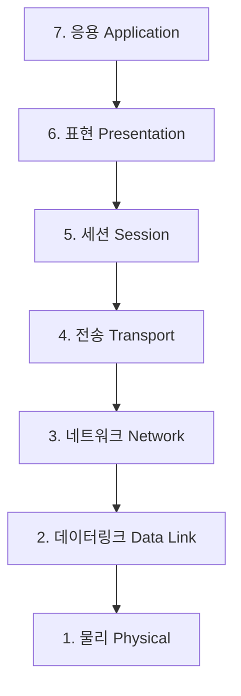
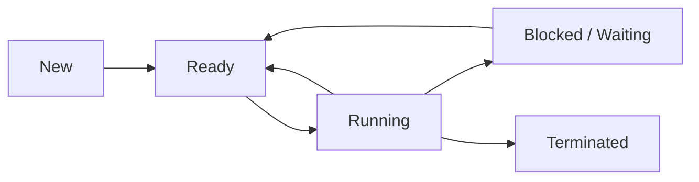

[3과목 데이터베이스 구축](/posts/infoproc-engineer-3-database-construction/)에 이어 **4과목 프로그래밍 언어 활용**이다. 직접 정리한 초안(OSI 7계층, TCP/IP, IP 주소체계, C 언어 문법, 페이지 교체 알고리즘, 교착상태, UNIX 구성 등)을 기반으로, 시험에 자주 나오지만 초안에는 없던 프로세스 상태 전이·CPU 스케줄링, 공간 구역성, C 언어 전체 연산자 우선순위, 기억 클래스, Java 주요 예외, Python 기초, TCP·UDP 비교 등을 최대한 보강했다. 초안의 오탈자(malloc, stdio.h 등)와 일부 헷갈리는 서술(IPv4 자동 주소설정, 자바스크립트 클래스 기반 등)은 표준 정의에 맞게 바로잡고 ⚠️ 함정으로 표시해두었다.

> 🔥 표시는 시험에 반복 출제되는 **필수 암기 포인트**, ⚠️ 표시는 **헷갈리기 쉬운 함정**이다.
{: .prompt-info }

---

## 1. OSI 7계층



| 계층 | 주요 기능 | 대표 프로토콜/표준 |
|---|---|---|
| **7. 응용 (Application)** | 사용자(응용 프로그램)가 OSI 환경에 접근할 수 있도록 서비스 제공. 응용 프로세스 간 정보 교환, 전자 사서함, 파일 전송 등 | HTTP, FTP, SMTP |
| **6. 표현 (Presentation)** | 서로 다른 데이터 표현 형식을 가진 시스템 간 상호 접속을 위한 변환. 코드 변환, 데이터 암호화·압축, 구문 검색, 포맷 변환 | - |
| **5. 세션 (Session)** | 송수신 측 간의 관련성 유지 및 대화 제어. 대화 구성·동기 제어, 데이터 교환 관리. 연결의 생성·관리·종료에 **토큰** 사용 | - |
| **4. 전송 (Transport)** | **종단 시스템(End-to-End)** 간 투명한 데이터 전송 제공. 하위 3계층과 상위 3계층의 인터페이스 담당. 주소 설정, 다중화, 오류 제어, 흐름 제어 | TCP, UDP |
| **3. 네트워크 (Network)** | 개방 시스템 간 네트워크 연결 관리, 데이터 교환 및 중계. 경로 설정, 트래픽 제어, 패킷 정보 전송 | IP, X.25 |
| **2. 데이터링크 (Data Link)** | 인접한 두 시스템 간 신뢰성 있고 효율적인 정보 전송. 흐름 제어, 프레임 동기화, 오류 제어, 순서 제어 | HDLC, LAPB, LLC, PPP |
| **1. 물리 (Physical)** | 두 장치 간 실제 접속·절단의 기계적·전기적·기능적·절차적 특성 정의. 전송 매체·신호 방식 정의 | RS-232C, X.21 |

> 🔥 IP는 **헤더 체크섬만 제공**하며(데이터 영역 오류 검출은 하지 않음), **Best Effort 원칙**에 따른 비연결형 전송을 수행한다 — 네트워크 계층 설명에서 매회 출제.
{: .prompt-tip }

---

## 2. TCP/IP

인터넷에 연결된 서로 다른 기종의 컴퓨터들이 데이터를 주고받을 수 있도록 하는 표준 프로토콜. 1960년대 말 ARPA에서 개발해 ARPANET(1972)에서 사용되기 시작했고, UNIX의 기본 프로토콜로 쓰이다 현재는 인터넷 범용 프로토콜로 사용된다. **TCP(전송) + IP(네트워크)** 두 프로토콜의 결합이다.

| 구분 | TCP | IP |
|---|---|---|
| OSI 계층 | 전송(4계층) | 네트워크(3계층) |
| 서비스 방식 | 신뢰성 있는 **연결형** 서비스 | **비연결형**(데이터그램 기반) 서비스 |
| 주요 기능 | 패킷의 다중화, 순서 제어, 오류 제어, 흐름 제어, 스트림 전송 | 패킷의 분해·조립, 주소 지정, 경로 선택 |
| 헤더 길이 | - | 최소 20바이트 ~ 최대 60바이트 |

**TCP vs UDP**

| 구분 | TCP | UDP |
|---|---|---|
| 연결 방식 | 연결형 | 비연결형 |
| 신뢰성 | 높음 (순서 제어·재전송·흐름 제어) | 낮음 (오류 검출만, 재전송 없음) |
| 헤더 구조 | 복잡 | 단순, 오버헤드 적음 |
| 용도 | 파일 전송, 웹(HTTP) 등 신뢰성이 중요한 통신 | 실시간·멀티캐스트 통신 등 속도가 중요한 통신 |
| 주소 지정·경로 설정 | - | 수행하지 않음 |

---

## 3. IP 주소체계

| 구분 | IPv4 | IPv6 |
|---|---|---|
| 주소 길이 | 32비트 | **128비트** (16비트씩 8부분, 콜론으로 구분해 16진수 표기) |
| 헤더 길이 | **가변** (최소 20바이트 ~ 최대 60바이트) | **고정 40바이트(옥텟)** |
| 주소 클래스 | A/B/C/D/E 클래스별로 네트워크·호스트 주소 길이가 다름 | 클래스 개념 없음 |
| 주소 자동설정 | 기본적으로 지원 X (DHCP 등 별도 서비스 필요) | **자체적으로 주소 자동설정 기능 지원** |
| 지원 주소 방식 | 유니캐스트, 브로드캐스트, 멀티캐스트 | 유니캐스트, 멀티캐스트, 애니캐스트 (브로드캐스트 없음) |
| 전송 속도·호환성 | - | IPv4보다 전송 속도가 빠르고 확장성·호환성이 뛰어남 |

> ⚠️ **주소 자동설정 기능은 IPv6의 특징**이다. "IPv4가 호스트 주소를 자동으로 설정해 유니캐스트를 지원한다"는 식의 서술은 틀린 보기이니 주의.
{: .prompt-warning }

**IPv4 ↔ IPv6 전환 기술**

| 기술 | 설명 |
|---|---|
| **듀얼 스택 (Dual Stack)** | 하나의 장비가 IPv4/IPv6 두 프로토콜 스택을 모두 지원 |
| **터널링 (Tunneling)** | IPv6 패킷을 IPv4 패킷 안에 캡슐화해 IPv4 망을 통과시키는 방식 |
| **헤더 변환 (Header Translation)** | IPv4 헤더와 IPv6 헤더를 상호 변환 |

**서브넷팅 (Subnetting)**

- 하나의 네트워크 주소를 여러 개의 작은 서브넷으로 나누는 것
- 서브넷 마스크(Subnet Mask)의 비트 수만큼 네트워크 영역이 늘어나고, 호스트 영역은 줄어듦
- 사용 가능한 호스트 수 = **2^(호스트 비트 수) − 2** (네트워크 주소, 브로드캐스트 주소는 제외)

> 🔥 서브넷팅 계산 문제(사용 가능 호스트 수, 서브넷 개수 구하기)는 5과목에서도 자주 재출제되는 대표적인 계산 유형이다.
{: .prompt-tip }

---

## 4. 오류 제어와 네트워크 표준

### 4-1. 자동 반복 요청 방식 (ARQ)

| 방식 | 설명 |
|---|---|
| **Stop-and-Wait ARQ** | 한 프레임을 보내고 확인응답(ACK)을 받은 뒤 다음 프레임을 전송(정지-대기) |
| **Go-Back-N ARQ** | 여러 프레임을 연속 전송하다 오류 발생 시, 오류 발생 프레임부터 **이후 모든 프레임을 재전송** |
| **Selective-Repeat ARQ** | 오류가 발생한 프레임**만** 선택적으로 재전송 |
| **Adaptive ARQ** | 전송 효율에 따라 프레임 길이를 적응적으로 조절 |

### 4-2. IEEE 802 표준

| 표준 | 내용 |
|---|---|
| **802.1** | 전체 구성, OSI 참조 모델과의 관계, 통신망 관리 |
| **802.2** | 논리 링크 제어(LLC) 계층 |
| **802.3** | CSMA/CD 방식의 매체 접근 제어(MAC) |
| **802.4** | 토큰 버스 방식의 매체 접근 제어 |
| **802.5** | 토큰 링 방식의 매체 접근 제어 |
| **802.6** | 도시형 통신망(MAN) |

---

## 5. 프로세스와 CPU 스케줄링

### 5-1. 프로세스 상태 전이



| 상태 | 설명 |
|---|---|
| **New** | 프로세스가 생성되는 중인 상태 |
| **Ready** | CPU 할당을 기다리는 상태 |
| **Running** | CPU를 할당받아 실행 중인 상태 |
| **Blocked (Waiting)** | 입출력 등 이벤트의 완료를 기다리는 상태 |
| **Terminated** | 실행이 종료된 상태 |

### 5-2. CPU 스케줄링 기법

| 기법 | 설명 |
|---|---|
| **FCFS (First Come First Served)** | 도착한 순서대로 처리하는 **비선점** 기법 |
| **SJF (Shortest Job First)** | 실행시간이 가장 짧은 작업을 우선 처리하는 비선점 기법 |
| **SRT (Shortest Remaining Time)** | SJF의 **선점형** 버전. 남은 실행시간이 가장 짧은 작업을 우선 처리 |
| **Round Robin** | 일정 시간(Time Quantum) 단위로 순환하며 처리하는 선점 기법 |
| **Priority** | 우선순위가 높은 작업을 먼저 처리 |
| **HRN (Highest Response-ratio Next)** | SJF의 단점(무한 대기)을 보완한 비선점 기법 |

> 🔥 HRN 공식은 계산 문제로 자주 출제된다: **우선순위 = (대기 시간 + 서비스 시간) / 서비스 시간**
{: .prompt-tip }

---

## 5-3. 운영체제(OS) 개요

컴퓨터 시스템의 자원을 효율적으로 관리하며 사용자에게 편리한 환경을 제공하는 시스템 소프트웨어.

> 🔥 4대 성능 평가 기준은 이름-정의 매칭으로 초고빈도 출제.
{: .prompt-tip }

| 평가 기준 | 설명 |
|---|---|
| **처리 능력 (Throughput)** | 일정 시간 내에 시스템이 처리하는 일의 양 |
| **반환 시간 (Turn Around Time)** | 작업을 의뢰한 시간부터 처리가 완료될 때까지 걸린 시간 |
| **사용 가능도 (Availability)** | 시스템을 사용할 필요가 있을 때 즉시 사용 가능한 정도 |
| **신뢰도 (Reliability)** | 시스템이 주어진 문제를 정확하게 해결하는 정도 |

### 5-4. 스레드(Thread) / PCB

- **스레드**: 프로세스 내에서의 작업 단위. 시스템 자원을 할당받아 실행하는 최소 단위로, **경량 프로세스**라고도 함. 사용자 수준(빠르지만 구현 어려움)과 커널 수준(구현 쉽지만 느림)으로 분류
- **PCB (Process Control Block)**: 운영체제가 프로세스에 대한 중요 정보(현재 상태, 포인터, 고유 식별자, 우선순위, CPU 레지스터 정보 등)를 저장해 놓는 곳. 프로세스 생성 시 만들어지고 종료 시 제거됨

### 5-5. 스래싱 (Thrashing)

프로세스의 처리 시간보다 **페이지 교체에 소요되는 시간이 더 많아지는** 현상. 다중 프로그래밍의 정도가 지나치게 높아지면 CPU 이용률이 오히려 급격히 감소한다. 워킹 셋 유지, 다중 프로그래밍 정도 조절 등으로 방지할 수 있다.

---

## 6. 기억장치 관리

### 6-1. 구역성 (Locality)

| 구역성 | 설명 |
|---|---|
| **시간 구역성 (Temporal Locality)** | 프로세스가 실행되면서 하나의 페이지를 일정 시간 동안 집중적으로 액세스하는 현상. 한 번 참조한 페이지는 가까운 시간 내에 다시 참조될 가능성이 높음. **스택, 서브루틴(Subroutine), 순환문(Loop), 카운팅·집계에 사용되는 변수** 등에서 나타남 |
| **공간 구역성 (Spatial Locality)** | 실행 중인 페이지 근처에 있는 페이지가 다시 참조될 가능성이 높은 현상. **배열 순회, 프로그램의 순차적 실행** 등에서 나타남 |

> 🔥 "배열·순차적 코드 실행"이 나오면 **공간 구역성**, "반복문·스택처럼 같은 위치를 반복 참조"하면 **시간 구역성**.
{: .prompt-tip }

### 6-1-1. 기억장치 배치(Placement) 전략

> 🔥 이름-정의 매칭으로 초고빈도 출제.
{: .prompt-tip }

| 전략 | 설명 |
|---|---|
| **최초 적합 (First Fit)** | 들어갈 수 있는 빈 영역 중 **첫 번째** 분할 영역에 배치 |
| **최적 적합 (Best Fit)** | 들어갈 수 있는 빈 영역 중 **단편화를 가장 작게** 남기는 영역에 배치 |
| **최악 적합 (Worst Fit)** | 들어갈 수 있는 빈 영역 중 **단편화를 가장 많이** 남기는 영역에 배치 |

### 6-2. 페이징 기법

- 가상기억장치에 보관된 프로그램과 주기억장치 영역을 동일한 크기로 나눔 → 나눠진 프로그램(페이지)을 동일 크기의 주기억장치 영역(**페이지 프레임**)에 적재해 실행
- 페이지 맵 테이블 사용으로 비용은 증가하고 처리 속도는 감소함

| 페이지 크기가 **작아질수록** | 영향 |
|---|---|
| 기억장소 이용 효율 | 증가 |
| 입출력 시간(오버헤드) | **증가** |
| 내부 단편화 | 감소 |
| 페이지 맵 테이블 크기 | 증가 |

> ⚠️ 페이지 크기가 작아지면 기억장소 효율은 좋아지지만, 입출력 횟수·페이지 맵 테이블 크기 등 **오버헤드는 오히려 증가**한다 — "작을수록 무조건 좋다"고 생각하면 함정.
{: .prompt-warning }

### 6-3. 페이지 교체 알고리즘

| 알고리즘 | 설명 |
|---|---|
| **OPT (Optimal Replacement)** | 앞으로 가장 오랫동안 사용되지 않을 페이지를 교체(이론적 최적, 실제 구현 불가) |
| **FIFO (First In First Out)** | 가장 먼저 적재되어 가장 오래 있었던 페이지를 교체 |
| **LRU (Least Recently Used)** | 가장 오랫동안 사용되지 않은(최근에 참조되지 않은) 페이지를 교체 |
| **LFU (Least Frequently Used)** | 참조(사용) 빈도가 가장 적은 페이지를 교체 |
| **NUR (Not Used Recently)** | 최근에 사용하지 않은 페이지를 교체. **참조 비트**와 **변형(수정) 비트**를 사용 |
| **SCR (Second Chance Replacement)** | FIFO의 단점을 보완. 가장 오래된 페이지 중 자주 사용되는 페이지는 교체를 미루고 한 번 더 기회를 줌 |

> ⚠️ **LFU는 Least Frequently Used**(최소 빈도)의 약자다. "Last"가 아니라 "Least"이므로 혼동하지 말 것.
{: .prompt-warning }

---

## 7. 교착상태(Deadlock) 발생의 필요충분조건

| 조건 | 설명 |
|---|---|
| **상호 배제 (Mutual Exclusion)** | 한 번에 한 개의 프로세스만 공유 자원을 사용할 수 있음 |
| **점유와 대기 (Hold and Wait)** | 최소 하나의 자원을 점유한 채, 다른 프로세스가 사용 중인 자원을 추가로 요구하며 대기 |
| **비선점 (Non-preemption)** | 다른 프로세스에 할당된 자원은 사용이 끝날 때까지 강제로 빼앗을 수 없음 |
| **환형 대기 (Circular Wait)** | 프로세스들이 원형으로 자원을 점유하면서 앞/뒤 프로세스의 자원을 요구 |

> 🔥 네 조건이 **모두** 성립해야 교착상태가 발생한다. [3과목의 교착상태 해결 방법](/posts/infoproc-engineer-3-database-construction/)(예방/회피/발견 및 회복)과 세트로 암기하면 좋다.
{: .prompt-tip }

---

## 8. Working Set

운영체제의 가상기억장치 관리에서, 프로세스가 일정 시간 동안 자주 참조하는 페이지들의 집합.

---

## 9. 파일 디스크립터 (File Descriptor)

- 리눅스·유닉스에서 프로세스가 파일에 접근하는 데 사용하는 일종의 키. 파일 관리를 위해 시스템이 필요로 하는 정보를 가짐
- 보조기억장치에 저장되어 있다가 파일이 개방(open)되면 주기억장치로 이동
- 파일 제어 블록(FCB), 파일 핸들로도 불림

> ⚠️ 사용자는 파일 디스크립터의 정보를 **확인은 할 수 있지만 직접 참조(조작)는 할 수 없다**.
{: .prompt-warning }

**주기억장치 vs 보조기억장치**

| 구분 | 주기억장치 | 보조기억장치 |
|---|---|---|
| 접근 속도 | 매우 빠름 | 상대적으로 느림 |
| 휘발성 | 대부분 휘발성(RAM) | 비휘발성 |
| 용도 | CPU가 직접 실행 중인 프로그램·데이터 처리 | 데이터 영구 저장, 대용량 |
| 예 | RAM, ROM | SSD, HDD, SD카드 |

---

## 10. UNIX 시스템의 구성

| 구성요소 | 설명 |
|---|---|
| **커널 (Kernel)** | 유닉스의 가장 핵심적인 부분. 부팅 시 주기억장치에 적재되어 상주 실행. 하드웨어 보호, 프로그램-하드웨어 간 인터페이스. 프로세스 생성·종료, 기억장치 할당·회수, 파일 시스템 관리, 프로세스 간 통신 등 담당 |
| **쉘 (Shell)** | 사용자 명령어를 인식해 프로그램을 호출·실행하는 명령어 해석기. 시스템-사용자 간 인터페이스. **주기억장치에 상주하지 않고** 파일 형태로 존재해 보조기억장치에서 교체 처리 가능. 파이프라인, 입출력 재지정 기능 지원 |
| **유틸리티 (Utility Program)** | 일반 사용자가 작성한 응용 프로그램 처리에 사용(DOS의 외부 명령어에 해당). 에디터, 컴파일러, 인터프리터, 디버거 등 |

---

## 11. 리눅스 Bash 쉘의 export 명령어

- "환경" 변수의 값을 변경하거나 새로운 "환경" 변수를 설정할 때 사용
- 매개변수 없이 사용하면 현재 설정된 환경 변수들을 출력
- 사용자가 생성한 변수는 export로 지정하지 않는 한 **현재 쉘에서만** 유효
- export로 지정하면 전역 변수처럼 취급되어 자식 프로세스에도 상속됨

---

## 12. C 언어

### 12-1. 연산자 우선순위

| 우선순위 (높음 → 낮음) | 연산자 |
|---|---|
| 1 | `()` (괄호) |
| 2 | 단항 연산자 (`!`, `~`, `++`, `--`, 형변환, `sizeof`) |
| 3 | 산술 연산자 (`*` `/` `%` 우선, 그다음 `+` `-`) |
| 4 | 시프트 연산자 (`<<`, `>>`) |
| 5 | 관계 연산자 (`<`, `<=`, `>`, `>=`) |
| 6 | 등가 연산자 (`==`, `!=`) |
| 7 | 비트 AND (`&`) |
| 8 | 비트 XOR (`^`) |
| 9 | 비트 OR (`|`) |
| 10 | 논리 AND (`&&`) |
| 11 | 논리 OR (`||`) |
| 12 | 조건(삼항) 연산자 (`?:`) |
| 13 | 대입 연산자 (`=`, `+=` 등) |
| 14 | 콤마 연산자 (`,`) |

> 🔥 큰 흐름만 암기: **괄호 > 산술 > 시프트 > 관계 > 등가 > 비트연산 > 논리연산 > 대입** — 대부분의 우선순위 비교 문제는 이 순서만 알아도 풀린다.
{: .prompt-tip }

### 12-2. 비트 연산자와 시프트 연산자

| 연산자 | 의미 |
|---|---|
| `&` | 비트 AND |
| `|` | 비트 OR |
| `^` | 비트 XOR |
| `~` | 비트 NOT (1의 보수) |
| `<<` | 왼쪽 시프트 |
| `>>` | 오른쪽 시프트 |

- `r = r << n` → `r × 2ⁿ` 과 같음 (왼쪽으로 n비트 이동 = 2의 n제곱을 곱한 것)
- `r = r >> n` → `r ÷ 2ⁿ` 과 같음

### 12-2-1. 변수명 작성 규칙

> 🔥 규칙 하나하나가 O/X 판별 문제로 매우 자주 출제된다.
{: .prompt-tip }

- 영문자, 숫자, `_`(언더바) 사용 가능, **첫 글자는 영문자나 `_`로 시작** (숫자로 시작 불가)
- 글자 수 제한 없음, 공백·특수문자(`*`,`+`,`-`,`/`) 사용 불가
- 대·소문자를 구분하며, 예약어는 변수명으로 사용 불가
- 변수명에 데이터 타입을 명시하는 표기법을 **헝가리안 표기법(Hungarian Notation)**이라 함

### 12-3. 기억 클래스 (Storage Class)

| 종류 | 설명 |
|---|---|
| **auto** | 함수 내에서 선언되는 지역변수의 기본 클래스. 함수 종료 시 소멸 |
| **static** | 함수 종료 후에도 값을 유지하는 정적 변수 |
| **register** | 레지스터에 저장을 요청하는 변수(빠른 접근, 개수 제한) |
| **extern** | 다른 파일에 선언된 전역 변수를 참조할 때 사용 |

### 12-4. 포인터와 배열 표기

| 표현 | 의미 |
|---|---|
| `&a[]` | 배열 a의 시작 주소 |
| `a` (배열명만) | 배열의 시작 주소 (포인터로 취급) |
| `a[]` (`&` 없이 인덱스 접근) | 배열 속 데이터(값) |
| `**p` (이중 포인터) | 포인터 변수를 가리키는 포인터. 포인터 변수의 주소를 저장 |

> ⚠️ 배열을 함수의 매개변수로 전달하면 배열 전체가 복사되는 게 아니라 **포인터(시작 주소)만 전달**된다 — 함수 내부에서 `sizeof`로는 원래 배열의 크기를 구할 수 없다는 점이 단골 함정이다.
{: .prompt-warning }

### 12-5. malloc() 함수

- 형식: `포인터 변수 = malloc(크기);`
- 지정된 크기(바이트 단위)만큼 메모리를 할당하는 **동적 메모리 할당** 함수
- `stdlib.h` 헤더 파일에 정의
- 성공 시 할당된 메모리 주소 반환, 실패 시 **NULL** 반환
- **힙(Heap) 영역**에 메모리를 할당하며, 사용 후 반드시 `free()` 함수로 메모리를 해제해야 함

> ⚠️ malloc()으로 할당한 메모리는 자동으로 해제되지 않는다 — `free()`를 호출하지 않으면 **메모리 누수(Memory Leak)**가 발생한다.
{: .prompt-warning }

### 12-6. 주요 헤더 파일

| 헤더 파일 | 기능 |
|---|---|
| **stdio.h** | 입출력 기능 제공 |
| **math.h** | 여러 수학 함수 제공 |
| **string.h** | 문자열 처리 기능 제공 (`strlen`, `strcpy`, `strrev`, `strcmp` 등) |
| **stdlib.h** | 자료형 변환, 메모리 할당(`malloc` 등) 기능 제공 |
| **time.h** | 시간 처리에 관한 기능 제공 |

### 12-7. 무한 루프

```c
for ( ; ; )
    printf("무한반복");
```

`for` 문에서 초기식·조건식·증감식을 모두 생략하면 조건식이 항상 참으로 간주되어 내부 코드가 무한히 반복 실행된다.

---

## 13. Java 예외 처리

| 예외 클래스 | 설명 |
|---|---|
| **ArithmeticException** | 정수를 0으로 나누는 등 산술 연산 오류 |
| **NullPointerException** | null 참조에 접근했을 때 |
| **ArrayIndexOutOfBoundsException** | 배열의 인덱스 범위를 벗어난 접근 |
| **ClassCastException** | 잘못된 형변환을 시도했을 때 |
| **NumberFormatException** | 문자열을 숫자로 변환할 수 없을 때 |
| **FileNotFoundException** | 존재하지 않는 파일을 읽으려 할 때 |

> 🔥 정수 나눗셈에서 0으로 나누면 `ArithmeticException`이 발생하지만, 실수(double/float) 나눗셈에서 0으로 나누면 예외 없이 `Infinity`/`NaN`을 반환한다 — 이 차이가 자주 출제된다.
{: .prompt-tip }

---

## 14. Python 기초

| 자료형 | 설명 |
|---|---|
| **list** | 순서가 있고 값 변경 가능(mutable), `[ ]` 사용 |
| **tuple** | 순서가 있고 값 변경 불가능(immutable), `( )` 사용 |
| **dict** | key-value 쌍으로 구성, `{ }` 사용 |
| **set** | 중복 불허, 순서 없음, `{ }` 또는 `set()` 사용 |

- 슬라이싱: `a[start:end:step]` — `end` 인덱스는 결과에 **포함되지 않음**
- 리스트 컴프리헨션: `[x for x in range(n)]`
- 들여쓰기(Indentation)로 코드 블록을 구분

> 🔥 슬라이싱에서 `end` 인덱스는 **결과에 포함되지 않는다**는 점이 계산 문제에서 자주 함정으로 나온다.
{: .prompt-tip }

> 🔥 2024년 1회차 이후 **매 회차 파이썬 문제가 최소 1문제 이상 꾸준히 출제**되고 있다 — 더 이상 C/Java 위주로만 준비하면 안 된다.
{: .prompt-tip }

---

## 15. JavaScript

- **프로토타입(Prototype) 기반** 객체지향 언어 — Prototype Link와 Prototype Object를 이용해 객체 간 상속을 구현
- **클라이언트용 스크립트 언어**로, 웹 브라우저에서 해석되어 실행됨
- 참고로 서버용 스크립트 언어에는 JSP, ASP, PHP, Python, Perl, Ruby 등이 있음

> ⚠️ 자바스크립트는 **클래스 기반이 아니라 프로토타입 기반** 언어다. "클래스 기반으로 객체 상속을 지원한다"는 설명이 나오면 틀린 보기다 (ES6의 `class` 문법도 내부적으로는 프로토타입 체인으로 동작).
{: .prompt-warning }

---

다음 편은 **5과목 정보시스템 구축관리**(소프트웨어 개발 방법론, 프로젝트 관리, 신기술 동향, 보안 등)로 마무리할 예정이다.
