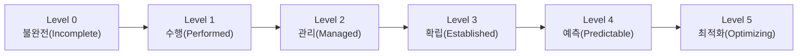
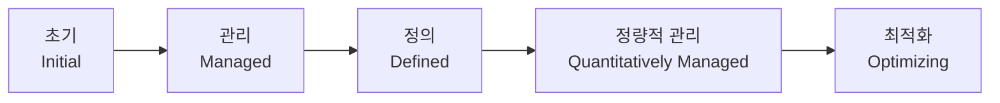

[4과목 프로그래밍 언어 활용](/posts/infoproc-engineer-4-programming-language/)에 이어 **5과목 정보시스템 구축관리**로, 정보처리기사 필기 5과목 시리즈의 마지막 편이다. 직접 정리한 초안(암호화 알고리즘, 프로젝트 관리 3P, CPM·간트·PERT, 개발 방법론, 신기술 용어, 보안 공격 기법 등)을 기반으로, 시험에 자주 나오지만 초안에는 없던 COCOMO, 해시 함수, 시큐어 코딩 7대 원칙 등을 보강했다. 초안의 오탈자(포트 번호, 공격 도구명 등)는 표준 정의에 맞게 바로잡고 ⚠️로 표시했다.

> 🔥 표시는 시험에 반복 출제되는 **필수 암기 포인트**, ⚠️ 표시는 **헷갈리기 쉬운 함정**이다.
{: .prompt-info }

---

## 1. 프로젝트 관리 기초

### 1-1. 프로젝트 관리의 3P

| 요소 | 설명 |
|---|---|
| **People (사람)** | 프로젝트 관리에서 가장 기본이 되는 인적 자원 |
| **Problem (문제)** | 사용자 입장에서 문제를 분석하여 인식 |
| **Process (프로세스)** | 소프트웨어 개발에 필요한 전체적인 작업 계획 및 구조(Framework) |

### 1-2. CPM (Critical Path Method, 임계경로기법)

- 프로젝트 완성에 필요한 작업을 나열하고, 작업에 필요한 소요 기간을 예측하는 데 사용하는 기법
- 각 작업이 수행되는 시간과 작업 사이의 관계를 파악할 수 있음
- **노드(작업)**와 **간선(작업 사이의 전후 의존 관계)**으로 구성. 화살표(간선)의 흐름에 따라 작업이 진행되며, 전 작업이 완료된 후 다음 작업 진행 가능
- 효과적인 프로젝트 통제와 경영층의 과학적인 의사 결정을 지원
- 병행 작업이 가능하도록 계획할 수 있음

> 🔥 **임계 경로(Critical Path) = 최장 경로**. "가장 짧은 경로"로 착각하지 않도록 주의.
{: .prompt-tip }

### 1-3. 간트 차트 vs PERT 차트

| 구분 | 간트 차트 (Gantt Chart) | PERT 차트 (Program Evaluation and Review Technique) |
|---|---|---|
| 형태 | 각 작업의 시작·종료 일정을 **막대 도표**로 표시 (시간선 차트) | 전체 작업의 상호 관계를 표시하는 **네트워크** |
| 표시 방식 | 수평 막대의 길이 = 각 작업의 기간 | 노드에는 작업을, 간선(화살표)에는 낙관치/기대치/비관치를 표시 |
| 소요 기간 예측 | 이미 알고 있는 일정을 시각화 | 낙관적/가능성 있는/비관적 경우로 나누어 각 단계별 종료 시기를 결정 |
| 적합한 상황 | 일반적인 일정 관리 | 과거 경험이 없어 소요 기간 예측이 어려운 프로젝트 |
| 제공 정보 | - | 작업 간 상호관련성, 결정경로, 경계시간, 자원할당 등 |

---

## 2. 비용 산정 기법

### 2-0. LOC 기법 (원시 코드 라인 수)

> 🔥 예측치 공식은 계산 문제로 출제 빈도가 매우 높다.
{: .prompt-tip }

소프트웨어 각 기능의 원시 코드 라인 수의 **비관치, 낙관치, 기대치**를 측정해 예측치를 구하고, 이를 이용해 비용을 산정하는 기법. 측정이 쉽고 이해하기 쉬워 가장 많이 사용된다.

`예측치 = (a + 4m + b) / 6` (a: 낙관치, b: 비관치, m: 기대치)

- 노력(인월) = LOC / 1인당 월평균 생산 코드 라인 수
- 개발 비용 = 노력(인월) × 단위 비용(1인당 월평균 인건비)
- 개발 기간 = 노력(인월) / 투입 인원
- 생산성 = LOC / 노력(인월)

### 2-1. COCOMO (Constructive Cost Model)

- **보헴(Boehm)**이 제안한 비용 산정 기법
- **원시 코드 라인 수(LOC)**를 이용해 산정하며, 단위는 **인월(Man-Month)**
- 중소 규모 소프트웨어 프로젝트에 적합

| 개발 유형 | 설명 |
|---|---|
| **Organic (단순형)** | 5만 라인 이하. 소규모 팀이 친숙한 환경에서 개발 |
| **Semi-detached (중간형)** | 30만 라인 이하. 다양한 경험 수준의 개발자들이 혼재되어 개발 |
| **Embedded (내장형)** | 초대형 규모. 하드웨어·소프트웨어 복합 시스템, 제약이 많은 환경 |

> ⚠️ COCOMO의 개발 유형은 **Organic / Semi-detached / Embedded** 3가지뿐이다. "Object", "Dynamic", "Function" 같은 보기는 COCOMO 유형이 아니므로 함정으로 자주 나온다.
{: .prompt-warning }

### 2-2. 기능 점수 모형 (Function Point, FP)

- **알브레히트(Albrecht)**가 제안
- 소프트웨어의 기능을 증대시키는 요인별로 가중치를 부여 → 요인별 가중치를 합산해 총 기능 점수 산출 → 총 기능 점수와 영향도를 이용해 기능 점수(FP)를 구하고, 이를 이용해 비용 산정
- 비용 산정에 이용되는 요소: 자료 입력(입력 양식), 정보 출력(출력 보고서), 명령어(사용자 질의 수), 데이터 파일, 필요한 외부 루틴과의 인터페이스

### 2-3. Putnam 모형

**Rayleigh-Norden 곡선**의 노력 분포도를 이용한 프로젝트 비용 산정 기법.

### 2-4. 델파이 모형 (Delphi)

- 전문가 감정(鑑定) 기법의 주관적인 편견을 보완하기 위해, 여러 전문가의 의견을 종합해 산정하는 기법
- 전문가들이 편견이나 분위기에 지배되지 않도록, **한 명의 조정자**와 여러 전문가로 구성

---

## 3. 개발 방법론

### 3-1. 구조적 방법론

- 정형화된 분석 절차에 따라 사용자 요구사항을 파악해 문서화하는 **Process 중심**의 방법론
- 1960년대까지 가장 많이 적용된 소프트웨어 개발 방법론
- 쉽게 이해·검증 가능한 프로그램 코드 생성이 목표
- 복잡한 문제를 다루기 위해 **분할과 정복(Divide and Conquer)** 원리 적용
- 절차: 타당성 검토 → 계획 → 요구사항 분석 → 설계 → 구현 → 시험 → 운용/유지보수

### 3-2. CBD (Component Based Design, 컴포넌트 기반 방법론)

- 컴포넌트의 재사용이 가능해 시간과 노력을 절감
- 유지보수 비용 최소화, 생산성 및 품질 향상
- 절차: 개발 준비 → 분석 → 설계 → 구현 → 테스트 → 전개 → 인도

### 3-3. V 모델

- 요구사항 → 분석 → 설계 → 구현 단계를 거치며, **각 단계를 테스트와 1:1로 연결**해 표현하는 모델
- **Perry**가 제안
- 세부적인 테스트 과정으로 구성되어 **신뢰성이 높음**
- 개발 작업과 검증 작업 사이의 관계를 명확히 드러낸, **폭포수 모델의 변형**으로 볼 수 있음

> 🔥 폭포수 모델이 **산출물 중심**이라면, V 모델은 **작업과 결과의 검증**에 초점을 둔다는 차이를 기억할 것.
{: .prompt-tip }

---

## 4. 프로세스 품질 표준

### 4-1. SPICE 모델의 프로세스 수행 능력 단계

| 단계 | 설명 |
|---|---|
| **Level 0 = 불완전 (Incomplete)** | 프로세스가 구현되지 않았거나 목적을 달성하지 못한 단계 |
| **Level 1 = 수행 (Performed)** | 프로세스가 수행되고 목적이 달성된 단계 |
| **Level 2 = 관리 (Managed)** | 정의된 자원의 한도 내에서 프로세스가 작업 산출물을 인도하는 단계 |
| **Level 3 = 확립 (Established)** | 소프트웨어 공학 원칙에 기반해 정의된 프로세스가 수행되는 단계 |
| **Level 4 = 예측 (Predictable)** | 프로세스가 목적 달성을 위해 통제되고, 양적인 측정을 통해 일관되게 수행되는 단계 |
| **Level 5 = 최적화 (Optimizing)** | 프로세스 수행을 최적화하고, 지속적인 개선을 통해 업무 목적을 만족시키는 단계 |

### 4-1-1. CMMI (능력 성숙도 통합 모델)

소프트웨어 개발 조직의 업무 능력·성숙도를 평가하는 모델(카네기멜론대 SEI 개발). SPICE(0~5, 6단계)와 달리 **5단계**로 구분한다.

> ⚠️ SPICE는 0(불완전)~5(최적화)의 **6단계**, CMMI는 1(초기)~5(최적화)의 **5단계** — 단계 수와 시작 번호가 다르다는 점이 단골 함정.
{: .prompt-warning }

### 4-2. ISO 12207

소프트웨어의 개발·운영·유지보수 등을 체계적으로 관리하기 위한 **소프트웨어 생명 주기 표준**.

| 구분 | 프로세스 |
|---|---|
| **기본 생명 주기 프로세스** | 획득, 공급, 개발, 운영, 유지보수 |
| **지원 생명 주기 프로세스** | 품질 보증, 검증, 확인, 활동 검토, 감사, 문서화, 형상 관리, 문제 해결 |
| **조직 생명 주기 프로세스** | 관리, 기반 구조, 훈련, 개선 |

### 4-3. Seven Touchpoints

SW 보안의 모범 사례를 SDLC(소프트웨어 생명주기)에 통합한 **소프트웨어 개발 보안 생명주기 방법론**.

---

## 5. 암호화

### 5-1. 개인키(대칭) 암호화 vs 공개키(비대칭) 암호화

| 구분 | 개인키 암호화 (대칭키, 단일키) | 공개키 암호화 (비대칭키) |
|---|---|---|
| 키 사용 방식 | **동일한 키**로 암호화·복호화 | 암호화는 **공개키**(공개), 복호화는 **비밀키**(비공개)로 수행 |
| 대표 알고리즘 | DES, SEED, AES, ARIA (블록 암호화) / LFSR, RC4 (스트림 암호화) | RSA (소인수분해 기반, MIT 개발) |
| 장점 | 암호화·복호화 속도가 빠름, 알고리즘 단순, 파일 크기가 작음 | 키 분배가 용이, 관리해야 할 키의 개수가 적음 |
| 단점 | 사용자 증가에 따라 관리해야 할 키의 수가 급격히 늘어남 | 암호화·복호화 속도가 느림, 알고리즘 복잡, 파일 크기가 큼 |
| 필요 키 개수 (n명) | **n(n-1)/2** | **2n** |

> 🔥 개인키 암호화는 **블록** 암호화(한 번에 한 블록씩)와 **스트림** 암호화(비트 단위)로 나뉜다는 점도 함께 암기.
{: .prompt-tip }

### 5-2. 대표 암호화 알고리즘

| 알고리즘 | 설명 |
|---|---|
| **ECC (Elliptic Curve Cryptography)** | 이산 대수 문제를 타원 곡선으로 옮겨 기밀성과 효율성을 높인 암호화 알고리즘 |
| **Rabin** | 소인수분해의 어려움에 안전성의 근거를 둔 암호화 알고리즘 |
| **ARIA** | 2004년 국가정보원과 산학연협회가 개발한 블록 암호화 알고리즘. 블록 크기 128비트, 키 길이에 따라 128/192/256비트로 분류 |
| **RSA** | 소인수분해의 어려움에 기반한 공개키(비대칭) 암호화 알고리즘. MIT에서 개발 |

### 5-3. 해시 함수 (Hash Function)

- 임의 길이의 입력 데이터를 **고정된 길이**의 출력값(해시값, 다이제스트)으로 변환하는 **단방향 함수**
- 암호화·복호화가 아니라 **무결성 검증**(위변조 확인)에 사용됨
- 입력이 조금만 달라져도 출력이 완전히 달라지는 특성(눈사태 효과), 역산이 불가능한 일방향성을 가짐
- 대표 알고리즘: MD5(128비트, 현재는 취약점으로 비권장), SHA-1(160비트, 취약점 발견), **SHA-256**(256비트, 현재 권장)

> ⚠️ 해시 함수는 **복호화가 불가능**하다. 대칭키·공개키 암호화(양방향)와 혼동하지 않도록 주의.
{: .prompt-warning }

---

## 6. 시큐어 코딩 (Secure Coding)

행정안전부·KISA의 "소프트웨어 개발보안 가이드" 기준, 시큐어 코딩의 7대 원칙(보안 약점 유형).

| 유형 | 설명 |
|---|---|
| **입력 데이터 검증 및 표현** | SQL Injection, XSS 등 입력값 검증 미흡으로 인한 취약점 방지 |
| **보안 기능** | 인증, 접근 제어, 기밀성, 암호화 등 보안 기능을 적절히 구현 |
| **시간 및 상태** | 경쟁 조건(Race Condition) 등 병행 처리 시 발생하는 취약점 방지 |
| **에러 처리** | 에러 상황을 안전하게 처리하고, 민감한 정보가 에러 메시지에 노출되지 않도록 함 |
| **코드 오류** | NULL 포인터 역참조, 자원 반환 누락 등 코딩상의 오류 방지 |
| **캡슐화** | 중요한 데이터와 기능을 캡슐화해 불필요한 노출 방지 |
| **API 오용** | 보안 기능이 없거나 부적절한 API 사용으로 인한 취약점 방지 |

---

## 7. 네트워크 장비와 기술

### 7-1. 네트워크 장비

| 장비 | OSI 계층 | 설명 |
|---|---|---|
| **리피터 (Repeater)** | 1계층 (물리) | 전송 선로 특성·외부 충격 등으로 왜곡되거나 약해진 신호를 원래 형태로 재생해 다시 전송 |
| **브리지 (Bridge)** | 2계층 (데이터링크, MAC) | LAN과 LAN, 또는 LAN 내 컴퓨터 그룹을 연결 |
| **스위치 (Switch)** | 2계층 (데이터링크) | LAN과 LAN을 연결해 더 큰 LAN을 구성하는 장치 |
| **라우터 (Router)** | 3계층 (네트워크) | LAN 간 연결에 **최적 경로 선택** 기능이 추가됨. 서로 다른 LAN·WAN 연결도 수행 |

### 7-2. Spanning Tree Algorithm (STA)

브리지와 LAN으로 구성된 통신망에서 **루프(폐회로)를 형성하지 않으면서** 연결을 설정하는 알고리즘.

### 7-3. 주요 프로토콜과 포트 번호

| 프로토콜 | 포트 | 전송 계층 |
|---|---|---|
| **DNS** | 53 | UDP |
| **Telnet** | 23 | TCP |
| **TFTP** | 69 | UDP |
| **RPC** | 111 | TCP/UDP |

> ⚠️ 초안에는 Telnet이 "TCP 63번"으로 되어 있었는데, 정확한 포트는 **TCP 23번**이다. DNS·RPC의 프로토콜 표기(UCP→UDP, UTP→TCP/UDP) 오타도 함께 바로잡았다.
{: .prompt-warning }

### 7-4. SDN (Software Defined Networking)

네트워크를 컴퓨터처럼 모델링해, 여러 사용자가 각자의 소프트웨어로 네트워킹을 가상화해 제어·관리하는 네트워크 기술.

---

## 8. IoT와 무선 네트워크 기술

| 기술 | 설명 |
|---|---|
| **IoT (Internet of Things)** | 정보통신 기술을 기반으로 실세계와 가상 세계의 다양한 사물들을 인터넷으로 연결해 진보된 서비스를 제공하는 기반 기술 |
| **올조인 (AllJoyn)** | 오픈소스 기반의 IoT 플랫폼. 서로 다른 운영체제·하드웨어를 쓰는 기기들이 표준화된 플랫폼으로 통신·제어 가능 |
| **MQTT** | 대역폭이 제한된 통신 환경에 최적화된, **푸시 기술 기반의 경량 메시지 전송 프로토콜**. IBM이 주도 개발 |
| **Zigbee** | 저속 전송 속도를 갖는 홈오토메이션 및 데이터 네트워크를 위한 표준 기술 |
| **PICONET** | 여러 독립된 통신 장치가 UWB(Ultra Wide Band) 또는 블루투스 기술로 통신망을 형성하는 무선 네트워크 기술 |

---

## 9. 블록체인·가상화·신기술

| 기술 | 설명 |
|---|---|
| **Blockchain** | P2P 네트워크를 이용해 온라인 금융 거래 정보를 네트워크 참여자들의 디지털 장비에 **분산 저장**하는 기술 |
| **DLT (Distributed Ledger Technology)** | 중앙 관리자·중앙 데이터 저장소 없이, P2P망 참여자들에게 모든 거래 목록이 분산 저장되고 거래 발생 시마다 지속적으로 갱신되는 디지털 원장 |
| **SDS (Software Defined Storage)** | 가상화를 적용해 필요한 만큼 나눠 쓸 수 있도록 하는(서버 가상화와 유사) 컴퓨팅 소프트웨어 기반 데이터 스토리지 체계 |
| **Docker** | 컨테이너 응용 프로그램의 배포를 자동화하는 오픈소스 엔진 |
| **SAMBA** | 인트라넷·인터넷에서 서버의 파일 및 프린터를 사용할 수 있게 하는 클라이언트/서버 프로토콜 기반 프리웨어. 리눅스, 유닉스, OpenVMS, OS/2 등 다양한 운영체제에 설치 가능 |

---

## 10. 정보 보안 요소

| 요소 | 설명 |
|---|---|
| **기밀성 (Confidentiality)** | 시스템 내의 정보와 자원은 인가된 사용자에게만 접근이 허용됨 |
| **무결성 (Integrity)** | 시스템 내의 정보는 오직 인가된 사용자만 수정할 수 있음 |
| **가용성 (Availability)** | 인가받은 사용자는 언제라도 사용할 수 있음 |
| **인증 (Authentication)** | 정보와 자원을 사용하려는 사용자가 합법적인 사용자인지 확인하는 모든 행위 |
| **부인 방지 (Non-Repudiation)** | 데이터를 송수신한 자가 송수신 사실을 부인할 수 없도록 증거를 제공 |

> 🔥 5과목의 신기술·보안 용어 문제는 매 시험 **이전에 나온 적 없는 새로운 용어**가 큰 비중으로 출제되는 경향이 강하다. 단순 암기보다 "처음 보는 용어라도 구성 요소를 보고 유추하는" 훈련이 더 중요하다.
{: .prompt-tip }

---

## 11. 보안 공격과 대응 기술

### 11-1. Session Hijacking (세션 하이재킹)

- 서버에 접속 중인 클라이언트의 세션 정보를 가로채는 공격 기법
- 정상적인 연결을 **RST(Reset) 패킷**으로 강제 종료시킨 뒤, 재연결 시 희생자가 아닌 공격자에게 연결되도록 하는 방식
- 탐지 방법: 비동기화 상태 탐지, ACK Storm 탐지, 패킷 유실·재전송 증가 탐지, 예상치 못한 접속 리셋 탐지

### 11-2. 블루투스 공격의 종류

| 공격 | 설명 |
|---|---|
| **블루버그 (BlueBug)** | 블루투스 장비 간 취약한 연결 관리를 악용해 휴대폰을 원격 조종하거나 통화를 감청 |
| **블루스나프 (BlueSnarf)** | 인증 없이 정보를 교환할 수 있는 OPP를 이용해 장비의 파일에 접근·열람 |
| **블루프린팅 (BluePrinting)** | 블루투스 공격 대상 장치를 검색하는 활동 |
| **블루재킹 (BlueJacking)** | 블루투스를 이용해 스팸처럼 명함을 익명으로 퍼뜨리는 공격 |

### 11-2-1. 네트워크 침해 공격 관련 용어

> 🔥 정보보안 침해공격 용어 문제 중 가장 자주 재출제되는 세트. 이름-정의 매칭으로 출제된다.
{: .prompt-tip }

| 용어 | 설명 |
|---|---|
| **Ping of Death (죽음의 핑)** | Ping 패킷 크기를 허용 범위 이상으로 전송해 네트워크를 마비시킴 |
| **SMURFING (스머핑)** | IP·ICMP 특성을 악용해 대량의 데이터를 한 사이트에 집중 전송 |
| **SYN Flooding** | 3-way-handshake를 의도적으로 중단시켜 서버를 대기 상태로 묶어둠 |
| **Land 공격** | 송신 IP와 수신 IP를 모두 공격 대상 IP로 위조해 전송 |
| **스미싱 (Smishing)** | 문자 메시지(SMS)로 개인·신용 정보를 탈취 |
| **피싱 (Phishing)** | 공기관·금융기관을 사칭한 이메일·메신저로 개인정보를 탈취 |
| **파밍 (Pharming)** | 악성코드로 PC의 DNS를 조작해 정상 사이트 접속 시에도 가짜 사이트로 유도 |

### 11-2-2. 그 밖의 정보보안 침해 공격 용어

| 용어 | 설명 |
|---|---|
| **웜 (Worm)** | 네트워크를 통해 스스로 복제되며 시스템 부하를 높여 다운시키는 악성코드 |
| **키로거 공격 (Key Logger Attack)** | 키보드 입력을 탐지해 ID·비밀번호·계좌번호 등을 몰래 빼감 |
| **랜섬웨어 (Ransomware)** | 파일을 암호화해 사용자가 열지 못하게 한 뒤 복호화 대가로 금전을 요구 |
| **백도어 (Back Door, Trap Door)** | 시스템 설계자가 만들어 둔 비밀 통로로, 무결성 검사·열린 포트 확인 등으로 탐지 가능 |

### 11-2-3. 솔트 (Salt)

동일한 패스워드라도 암호화 결과가 다르게 나오도록, 암호화에 앞서 원문에 덧붙이는 **무작위 값**. 같은 비밀번호를 쓰는 계정이 동시에 뚫리는 것을 방지한다.

### 11-3. DDoS 공격 도구

| 도구 | 설명 |
|---|---|
| **Trin00** | 최초로 알려진 UDP Flooding 기반 DDoS 공격 도구 |
| **TFN (Tribe Flood Network)** | ICMP, UDP, SYN Flooding 등 다양한 공격을 지원하는 DDoS 도구 |
| **Stacheldraht** | TFN을 발전시켜 암호화 통신 기능 등을 추가한 DDoS 공격 도구 |

### 11-4. 기타 보안 기술

| 기술 | 설명 |
|---|---|
| **Stack Guard** | 스택에서 발생하는 보안 약점을 막는 기술. **잘못된 복귀 주소의 호출**을 막아 버퍼 오버플로우 공격을 방지 |
| **tripwire** | 크래커가 침입해 백도어를 만들거나 설정 파일을 변경했을 때 이를 분석하는 도구 |
| **DPI (Deep Packet Inspection)** | OSI 7계층 전체의 프로토콜과 패킷 내부 콘텐츠를 파악해 침입 시도·해킹 등을 탐지하고 트래픽을 조정하는 패킷 분석 기술 |
| **BitLocker** | Windows 7부터 지원된 Windows 전용 볼륨 암호화 기능. **TPM**과 **AES-128** 알고리즘 사용 |

---

### 11-5. IDS / VPN / SSH

| 기술 | 설명 |
|---|---|
| **IDS (Intrusion Detection System, 침입 탐지 시스템)** | 비정상적인 사용·오용·남용을 실시간 탐지. **HIDS**(호스트 기반, 내부 감시)와 **NIDS**(네트워크 기반, 외부 침입 감시)로 구분 |
| **VPN (가상 사설 통신망)** | 공중 네트워크와 암호화 기술로 전용 회선처럼 사용하게 해주는 보안 솔루션 |
| **SSH (Secure SHell)** | 원격 로그인·명령 실행·파일 복사 등을 암호화해 안전하게 수행하는 프로토콜. 기본 포트 **22번** |

---

## 12. 파일 시스템 (NTFS)

- 윈도우 전용 파일 시스템으로, 다른 운영체제에서는 사용할 수 없음
- FAT, FAT32에 비해 성능·보안·안정성이 뛰어나며 시스템 리소스 최소화 가능
- 대용량 볼륨에 효율적. 파일·폴더 접근 제어 유지, 표준 사용자 계정 지원
- 자동 압축 기능 제공으로 저용량 볼륨도 효율적으로 사용 가능

> ⚠️ NTFS는 클러스터 크기 특성상, **저용량 볼륨에서는 오히려 FAT·FAT32보다 속도가 느릴 수 있다**.
{: .prompt-warning }

---

## 13. 데이터 수집·분석 기술

**스크랩 프로그램(빅데이터 수집 기술)**

| 데이터 유형 | 관련 기술 |
|---|---|
| **정형 데이터** | ETL, FTP, API, DB to DB, Sqoop |
| **비정형 데이터** | 크롤링, RSS, Open API, Chukwa, Kafka |
| **반정형 데이터** | Flume, Scribe, 스트리밍 |

**Data Mining**: 대량의 데이터를 분석해 데이터 속에 내재된 변수 간 상호관계를 규명하고, 일정한 패턴을 찾아내는 빅데이터 분석 기법.

| 기술 | 설명 |
|---|---|
| **하둡 (Hadoop)** | 오픈소스 기반 분산 컴퓨팅 플랫폼. 대형 스토리지를 가상화해 거대한 데이터 세트를 병렬 처리 |
| **맵리듀스 (MapReduce)** | 대용량 데이터 분산 처리 모델. 데이터를 분류하는 **Map** 작업 후 중복 제거·원하는 데이터를 추출하는 **Reduce** 작업 수행 |

> 🔥 최근 5과목은 SQL 문제 난이도가 높아지는 추세다. [3과목의 JOIN·서브쿼리](/posts/infoproc-engineer-3-database-construction/)를 함께 복습해두면 좋다. 페이지 교체 알고리즘·CPU 스케줄링·서브넷팅 같은 계산 문제는 [4과목](/posts/infoproc-engineer-4-programming-language/)과 겹쳐서 재출제되는 경우가 많다.
{: .prompt-tip }

---

## 14. TELNET

멀리 떨어져 있는 컴퓨터에 접속해 자신의 컴퓨터처럼 사용할 수 있도록 해주는 원격 접속 서비스.

---

[1과목 소프트웨어 설계](/posts/infoproc-engineer-1-software-design/) → [2과목 소프트웨어 개발](/posts/infoproc-engineer-2-software-development/) → [3과목 데이터베이스 구축](/posts/infoproc-engineer-3-database-construction/) → [4과목 프로그래밍 언어 활용](/posts/infoproc-engineer-4-programming-language/) → 5과목까지, 정보처리기사 필기 5과목 총정리 시리즈를 마친다.
