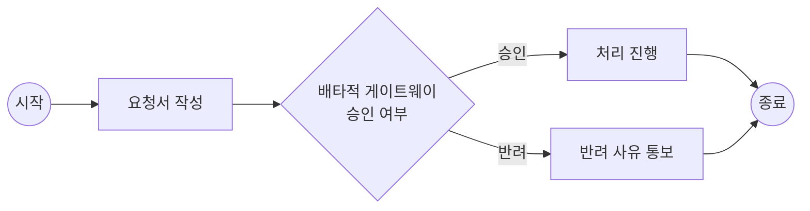

> 출처: [BPMN이란?](https://www.ibm.com/kr-ko/think/topics/bpmn)
{: .prompt-info }

업무 프로세스를 그림으로 그려서 공유해야 할 일이 생겨 BPMN을 정리해본다.

## 1. BPMN이란

**BPMN(Business Process Model and Notation)**은 비즈니스 프로세스를 문서화하기 위한 정확한 그래픽 표기법이다. 원래 BPMI(Business Process Management Initiative)에서 개발되었고, 2005년부터 **OMG(Object Management Group)**가 표준을 유지 관리하고 있다. **ISO/IEC 19510:2013**으로 국제 표준화되어 있어, 특정 벤더나 도구에 종속되지 않는다.

핵심은 "텍스트로 된 프로세스 명세의 모호함"을 시각적 언어로 해소해서, 비즈니스 분석가·개발자·현업 사용자가 **같은 그림을 보고 같은 것을 이해**하게 만드는 것이다.

> BPMN은 CMMN(사례 관리 모델 표기법), DMN(의사결정 모델 표기법)과 함께 OMG의 프로세스 관련 표준 3종("트리플 크라운")을 구성한다.
{: .prompt-tip }

## 2. 표기법 구성 요소

BPMN 다이어그램은 크게 흐름 개체, 연결 객체, 스윔레인, 아티팩트 네 종류의 요소로 구성된다.

### 2-1. 흐름 개체(Flow Objects)

| 요소 | 기호 | 의미 |
|---|---|---|
| **이벤트(Event)** | 원 | 프로세스의 시작·중간·종료를 트리거 |
| **활동(Activity)** | 둥근 직사각형 | 프로세스 중 실제로 수행되는 작업(태스크, 하위 프로세스) |
| **게이트웨이(Gateway)** | 다이아몬드 | 흐름이 갈라지거나 합쳐지는 의사결정 지점 |

### 2-2. 게이트웨이 5가지 유형

분기/합류 지점에서 흐름을 어떻게 처리할지가 게이트웨이 종류에 따라 달라진다.

| 유형 | 기호 | 동작 |
|---|---|---|
| **배타적(Exclusive)** | X | 여러 경로 중 조건에 맞는 **단 하나**만 선택 |
| **포괄적(Inclusive)** | 원 | 조건에 맞는 **하나 이상**의 경로를 동시에 선택 가능 |
| **병렬(Parallel)** | + | 조건 없이 **모든 경로를 동시에** 진행 |
| **병렬 이벤트 기반** | - | 이벤트 발생 여부에 따라 동시 경로가 갈라짐 |
| **복잡(Complex)** | * | 위 유형으로 표현 안 되는 복잡한 분기 로직 |

> 🔥 배타적 = 하나만, 병렬 = 전부 다, 포괄적 = 조건 맞는 것 전부 — 이 세 가지 차이가 실무에서 가장 헷갈리는 포인트다.
{: .prompt-tip }

### 2-3. 연결 객체(Connecting Objects)

| 요소 | 표기 | 용도 |
|---|---|---|
| **시퀀스 흐름(Sequence Flow)** | 실선 화살표 | 같은 풀(Pool) 안에서 활동이 실행되는 순서 |
| **메시지 흐름(Message Flow)** | 점선 화살표 | 서로 다른 풀(조직/부서) 간의 통신 |
| **연결(Association)** | 점선 | 아티팩트(주석, 데이터 객체 등)를 흐름 개체와 연결 |

### 2-4. 스윔레인(Swimlanes)

- **풀(Pool)**: 프로세스에 참여하는 주요 조직이나 시스템 전체를 표현하는 컨테이너
- **레인(Lane)**: 풀 내부를 역할·부서별로 나눈 구획 (예: 영업팀, 승인자, 시스템)

풀 사이의 흐름은 반드시 메시지 흐름(점선)으로 표현하고, 시퀀스 흐름(실선)은 하나의 풀을 넘어갈 수 없다는 점이 자주 헷갈리는 규칙이다.

### 2-5. 아티팩트(Artifacts)

데이터 객체, 그룹, 텍스트 주석 등으로, 다이어그램의 흐름 자체에는 영향을 주지 않지만 맥락 정보를 보충한다.

## 3. 간단한 예시

승인 요청 프로세스를 단순화하면 아래와 같은 흐름이 된다.

실제 BPMN 기호(원=이벤트, 다이아몬드=게이트웨이, 둥근 사각형=활동)와 완전히 동일하진 않지만, 요소 간 관계 구조는 이렇게 대응된다.

## 4. BPMN 모델의 3가지 종류

| 종류 | 설명 |
|---|---|
| **협업 다이어그램(Collaboration Diagram)** | 둘 이상의 프로세스(풀)가 메시지를 주고받는 상호작용을 표현 |
| **안무 다이어그램(Choreography Diagram)** | 참가자 간 메시지 교환의 순서 자체에 초점 (내부 로직은 생략) |
| **대화 다이어그램(Conversation Diagram)** | 협업 다이어그램을 단순화해서 메시지 교환 그룹만 표시 |

## 5. 왜 쓰는가

- 현재/미래 프로세스에 대해 이해관계자 간 빠르게 합의 도출
- 프로세스를 그림으로 남겨 신입 교육 자료·인수인계 문서로 활용
- 비즈니스 프로세스 리엔지니어링(BPR)의 분석 기반 마련
- 자동화·아웃소싱 대상 프로세스를 명확히 식별

## 6. 관련 표준과 비교

| 구분 | BPMN | UML | BPEL |
|---|---|---|---|
| **목적** | 비즈니스 프로세스 표현 | 소프트웨어 설계(클래스, 시퀀스 등) | 웹 서비스 프로세스의 실행 |
| **대상 독자** | 비즈니스 사용자 포함 전체 이해관계자 | 개발자 중심 | 실행 엔진(기계) |
| **형태** | 그래픽 표기법 | 그래픽 표기법 | XML 기반 실행 언어 |

> BPMN은 "사람이 읽는 프로세스 그림"이고, BPEL은 "기계가 실행하는 프로세스 코드"에 가깝다. 실제로 BPMN 다이어그램을 BPEL로 변환해 실행 엔진에 올리는 조합도 흔하다.
{: .prompt-tip }

## 7. 정리

BPMN은 결국 "누가 봐도 같은 프로세스로 이해되는 그림을 그리기 위한 문법"이다. 이벤트·활동·게이트웨이·흐름이라는 몇 안 되는 기호 조합만 정확히 익혀두면, 복잡한 업무 프로세스도 팀 전체가 공유할 수 있는 형태로 정리할 수 있다.
