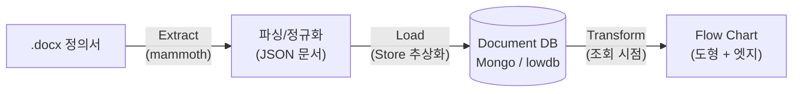

[BPMN 정리 글](/posts/bpmn-concepts-ko/)에서 "업무 프로세스를 그림으로 그려서 공유해야 할 일이 생겼다"고 썼는데, 그 요청의 실제 결과물이 이 글에서 다루는 프로세스 시각화 도구다. Word로 작성된 프로세스 정의서를 업로드하면 자동으로 표준 플로우차트 도형으로 그려주는 웹 대시보드를 직접 설계·구현했다.

> 이 글에는 실제 회사명, 시스템 로고, 사내 조직/문서 식별자는 담지 않았다. 예시로 드는 프로세스 이름(계약서 작성, 고객 피드백 등)은 실제 문서명이 아니라 역할을 알 수 있게 일반화한 이름이다. 승인율/소요시간/마진율 시리즈에서 다룬 DMS(Deal Management System)와 같은 계열의 영업 프로세스를 대상으로 한다.
{: .prompt-warning }

---

## 1. 문제: 정의서는 있는데, 그림은 매번 사람이 그려야 했다

사내에는 이미 프로세스별로 Word 정의서(총 20개 문서)가 있었다. 크게 두 레이어로 나뉜다.

- **macro(전체 흐름)**: 리드/기회 발생부터 계약 체결·청구·마감까지 이어지는 7단계 큰 흐름
- **detail(하위 상세)**: macro 중 특정 단계 아래에 딸린 세부 프로세스 그룹 — 계약검토 그룹(6개 문서), 사업성검토 그룹(8개 문서)

각 정의서에는 목적·범위·종료조건·담당자·단계(steps)·Pain Point 같은 항목이 표/문단으로 적혀 있었지만, 이걸 회의나 신규 입사자 교육에서 "한눈에 보이는 그림"으로 공유하려면 그때그때 파워포인트나 드로잉 툴로 다시 그려야 했다. 정의서가 수정되면 그림도 다시 그려야 하니, 원본(문서)과 그림(도식) 사이의 정합성이 계속 깨지는 구조였다.

목표는 명확했다: **정의서를 업로드하면 사람이 다시 그리지 않아도 표준 플로우차트 도형(시작/끝·처리·판단·입출력)으로 자동 렌더링**되게 하고, 전체(Overview) → 그룹(Detail) → 개별 단계(Step) 순으로 드릴다운할 수 있게 만드는 것.

---

## 2. 왜 ETL이 아니라 ELT로 설계했나

파이프라인은 Extract → Load → Transform 순서인데, 무거운 변환(그래프 조립, 도형 판별)을 적재 전이 아니라 **조회 시점**에 수행하도록 설계했다.



이렇게 나눈 이유는 화면에 필요한 그래프 구조·도형 판별 로직이 서비스 초기에 가장 자주 바뀌는 부분이었기 때문이다. 변환을 적재 시점에 미리 해두면 로직이 바뀔 때마다 전체 데이터를 다시 적재해야 하지만, 원본을 원본 그대로 저장해두고 조회 시점에만 그래프로 변환하면 로직 수정은 코드만 고치면 끝난다.

### Store 추상화 — 인프라 없이도 항상 돌아가게

저장 계층은 인터페이스로 추상화해서 `MONGODB_URI`가 설정되면 MongoDB를, 없으면 lowdb(JSON 파일)를 쓰게 했다. 여기서 한 걸음 더 나아가 **Mongo 연결 자체가 실패해도 자동으로 lowdb로 폴백**하도록 만들었다.

```ts
// db.ts의 initStore 개념 — 실패해도 데모가 죽지 않게
try {
  const mongoStore = await connectMongo(uri);
  return mongoStore;
} catch {
  console.warn("[db] Mongo 연결 실패 → lowdb로 폴백");
  return new LowdbStore();
}
```

데모/시연 환경에서는 MongoDB Atlas 계정을 준비하지 못했거나 네트워크가 막혀 있을 수 있는데, 이 폴백 덕분에 인프라 준비 여부와 무관하게 항상 시연이 가능하다. 컬렉션 스키마는 Mongo와 lowdb 양쪽 모두 동일하게 유지했고(`processes`, `steps`, `pain_points`, `edges`, `hierarchy` 등 7개 컬렉션), Mongo로 전환하면 `process_id` 인덱스와 `$lookup`으로 DB 레벨 조인이 가능하도록 스키마를 미리 맞춰뒀다.

---

## 3. Word 문서 파싱 — 자유 형식 문서를 구조화하기

`.docx` 업로드 처리는 `mammoth`로 서식을 걷어내고 평문 텍스트를 뽑는 것부터 시작한다.

```ts
const { value: rawText } = await mammoth.extractRawText({ buffer });
```

여기서부터가 실제로 신경 쓴 부분이다.

**1) 파일명에서 프로세스 ID/이름 추론.** 정의서 파일명이 `..._C1. 계약서 작성.docx`처럼 `{프로세스ID}. {프로세스명}` 규칙을 따르길래, 정규식으로 이를 파싱해 `process_id`와 `process_name`을 자동으로 채운다.

```ts
const m = base.match(/_([SCD]\d+)[.\s]+(.+)$/);
// => { id: "C1", name: "계약서 작성" }
```

**2) 라벨 기반 필드 매핑.** "목적/Scope/종료 조건/작성자/버전" 같은 라벨 뒤에 오는 텍스트를 한 줄 단위로 찾아 필드에 매핑한다. 정의서가 자유 형식이라 100% 자동 매핑은 불가능하다는 걸 인정하고, 추출 가능한 필드는 채우고 나머지는 `null`로 남기는 **원문 보존 원칙**을 세웠다 — 값이 없다고 임의로 채우거나 추측하지 않는다.

**3) 한글 파일명 mojibake 복원.** 업로드 클라이언트가 한글 파일명을 기본 latin1로 디코딩하면서 깨지는 경우가 있어서, mojibake 특성 문자가 섞여 있으면 latin1 → UTF-8로 재해석을 시도하고 복원 결과에 한글이 포함되면 그걸 채택하는 방어 로직을 넣었다.

```ts
if (/[À-ÿ]/.test(filename)) {
  const restored = Buffer.from(filename, "latin1").toString("utf-8");
  if (/[가-힣]/.test(restored)) return restored;
}
```

---

## 4. 핵심 로직: 표준 도형을 "판별"하는 알고리즘

이 프로젝트에서 가장 신경 쓴 로직은 **그래프 위상 + 텍스트 키워드만으로 각 노드의 플로우차트 표준 도형을 자동 판별**하는 부분이다. 사람이 일일이 "이 단계는 마름모, 저 단계는 사각형"이라고 지정하지 않아도 된다.

| 도형 | 조건 |
|---|---|
| **terminator** (타원, 시작/끝) | 진입 엣지 0개 또는 진출 엣지 0개 |
| **decision** (마름모, 판단) | 분기(branch) 엣지 2개 이상, 또는 판단 키워드(확인/검토/여부/승인/분류) 포함 |
| **io** (평행사변형, 입출력) | 입출력 키워드(업로드/제출/회신/조회/등록/동기화 등) 포함 |
| **process** (직사각형, 처리) | 그 외 일반 작업 |

```ts
function decideShape(opts: { indeg: number; outdeg: number; branchOut: number; ioHint: boolean }) {
  if (opts.indeg === 0) return { shape: "terminator", terminal: "start" };
  if (opts.outdeg === 0) return { shape: "terminator", terminal: "end" };
  if (opts.branchOut >= 2) return { shape: "decision" };
  if (opts.ioHint) return { shape: "io" };
  return { shape: "process" };
}
```

여기서 놓치기 쉬운 디테일 하나: **반려(rollback) 엣지는 차수 계산에서 제외**한다. 반려로 되돌아가는 역방향 엣지까지 진출 차수에 포함시키면, 실제로는 정상 종료 지점인 노드도 "진출 엣지가 있다"는 이유로 terminator가 아닌 것으로 잘못 판별되기 때문이다. 반려 흐름은 도형 판별과는 별개로 화면에 빨간 점선으로 표시한다.

이 로직 하나로, 예를 들어 "딜 유형을 Fast Track/Standard/Complex 세 갈래로 분류하는" 단계는 branch 엣지가 3개 나가므로 자동으로 마름모(decision)가 되고, "계약서 업로드" 같은 단계는 키워드 매칭으로 자동으로 평행사변형(io)이 된다 — 정의서를 새로 업로드해도 도형을 다시 지정할 필요가 없다.

---

## 5. 3단계 드릴다운 뷰

같은 원본 데이터를 조회 시점에 세 가지 다른 그래프로 조립한다.

| 뷰 | API | 내용 |
|---|---|---|
| Broad | `/api/flow/macro` | 전체 macro 흐름 |
| Detail | `/api/flow/detail/:macroId` | 특정 macro 하위의 상세 프로세스 그룹 흐름 |
| Step | `/api/flow/steps/:processId` | 개별 프로세스의 단계 흐름 |

Detail 뷰는 그룹 내부 노드만 보여주지 않고, 그룹 경계를 넘나드는 엣지(다른 그룹으로 빠지는 분기, 다음 단계로 넘어가는 연결)까지 포함해서 그룹 밖 노드를 "외부 노드"로 함께 표시한다. 그래야 실제 프로세스 흐름이 잘려 보이지 않는다.

---

## 6. 비즈니스 임팩트

- **문서와 그림의 정합성 문제 해결**: 정의서가 바뀌어도 재업로드만 하면 그림이 자동으로 갱신된다. 더 이상 "문서는 고쳤는데 그림은 옛날 버전"인 상태가 생기지 않는다.
- **드릴다운으로 청중에 맞는 해상도 제공**: 경영진 보고에는 Overview(전체 흐름), 실무 교육/인수인계에는 Step 단위까지 내려가는 상세 흐름을 같은 도구, 같은 데이터로 제공한다.
- **인프라 요구사항을 낮춘 데모 설계**: MongoDB 없이도 lowdb 폴백으로 바로 시연 가능해서, 도구 자체를 제안/공유하는 초기 단계의 진입장벽을 낮췄다.

---

다음 편에서는 이 그래프(노드 20개, 엣지 22개 규모)를 실제 화면에 그리면서 부딪힌 문제 — 분기·반려 엣지가 뒤섞이며 화면을 뒤덮던 문제와, 이를 스윔레인 레이아웃과 엣지 라우팅으로 풀어간 과정을 다룬다.
