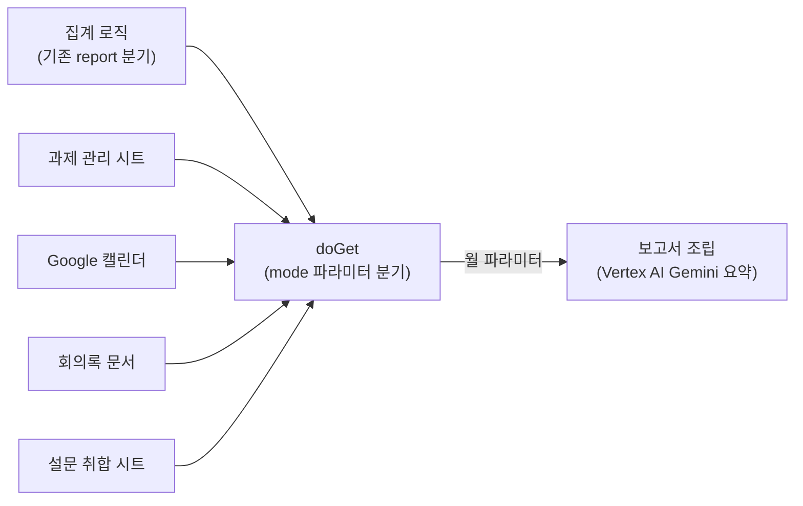

[PI 포털](/posts/pi-portal-apps-script/)을 만들어 사내 프로세스 개선 안건을 접수·추적·평가하는 일은 자동화했지만, 그 활동을 매월 정리해 보고하는 일은 여전히 사람이 손으로 하고 있었다. 이 글은 그 월간 보고서(MBR, Monthly Business Review) 작성을 자동화하면서 기존 포털에 무엇을 얹었는지, 왜 그렇게 설계했는지를 다룬다.

> 이 글에는 회사명, 실제 안건 내용, 부서명, 실제 수치는 담지 않았다. 엔드포인트 이름·필드명은 실제 코드에 쓰인 이름이지만 회사 고유 식별자는 아니다.
{: .prompt-warning }

---

## 1. 문제 정의 — 판단이 필요한 곳과 계산으로 끝나는 곳

전사 프로세스 혁신 활동은 매월 보고서로 정리된다. 원자료는 네 곳에 흩어져 있다.

- 과제 목록과 논의 이력 — 스프레드시트
- 회의 일정 — 캘린더
- 회의 결과 — 안건별로 갈라진 개별 문서
- 만족도 응답 — 별도 시트

기존 작업은 이 네 곳을 사람이 열어보며 수기로 옮기는 방식이었다. 매월 반복되는 작업을 뜯어보면 세 가지 유형으로 나뉜다.

| 작업 유형 | 내용 |
|---|---|
| 집계 | 건수, 비율, 완료율, 분포 표 |
| 전사 | 회의 일정, 신규 안건, 증빙 링크 |
| 요약 | 회의록에서 결론 도출, 문체 통일 |

앞의 두 가지는 계산과 치환이라 코드로 짜면 틀릴 일이 없다. 세 번째만 판단이 필요하다. **판단이 필요한 구간과 계산으로 끝나는 구간을 먼저 나누는 것**이 이 시스템 설계의 출발점이 됐다 — 계산 구간은 코드가 확정 출력하고, 판단 구간만 LLM에 맡기면 검수 범위가 좁아지고 틀렸을 때 어디를 고쳐야 하는지가 분명해진다.

---

## 2. 아키텍처 — 새 인프라 대신 기존 포털에 얹기

데이터 소스는 이미 사내 Google Workspace 안에 있었고, 그걸 읽는 Apps Script 웹앱(PI 포털)도 이미 운영 중이었다. 새 서버나 DB를 만드는 대신, 그 웹앱에 **읽기 전용 JSON 엔드포인트**를 덧붙였다. 기존 포털 화면(`doGet`이 반환하던 HTML)은 그대로 두고, 파라미터로 분기만 늘렸다.



| 데이터 소스 | 엔드포인트(mode) | 보고서 구간 |
|---|---|---|
| 집계 로직(기존) | `report` | Tier·상태 분포, 완료율 |
| 과제 관리 시트 | `rows` | 신규 안건, 부서·분야별 현황 |
| Google 캘린더 | `calendar` | 회의 일자·시간, 안건 번호 매핑 |
| 회의록 문서 | `minutes` | 안건별 배경·합의사항·Next Step |
| 설문 취합 시트 | `survey` | 만족도 평균·분포, 저평가 사유 |

각 엔드포인트는 월 파라미터를 받아 해당 월 데이터만 반환한다. 전체를 내보내면 응답이 수백 KB로 커지지만, 월 단위로 자르면 상세 텍스트를 포함해도 20~30KB에 머문다.

`Code.gs`에 실제로 들어간 변경은 세 갈래다.

1. **헬퍼 함수 추가** — `piRows_`, `piCalendar_`/`piTaskNo_`, `piMinutes_`/`piReadDoc_`, 유틸(`piNow_`, `piJson_`)
2. **`doGet` 교체** — 기존 `report` 분기는 그대로 두고 `rows`/`survey`/`calendar`/`minutes` 네 모드 추가
3. **`appsscript.json` 스코프 추가** — `calendar.readonly`, `documents`(읽기 전용이 아님 — 이유는 아래), `drive.readonly`, `script.container.ui`(메뉴 모달용)

```js
// doGet — 기존 포털 HTML 반환은 그대로, mode 파라미터로 JSON 엔드포인트만 추가
function doGet(e) {
  const mode = e.parameter.mode;
  if (mode === 'rows')     return piJson_(piRows_(e.parameter.month));
  if (mode === 'calendar') return piJson_(piCalendar_(e.parameter.month));
  if (mode === 'minutes')  return piJson_(piMinutes_(e.parameter.taskNo));
  if (mode === 'survey')   return piJson_(piSurvey_(e.parameter.month));
  // mode 없으면 기존 report 분기 → 기존 포털 화면 그대로
  return renderPortalHtml_();
}
```

### 2.1. 회의록 자동 수집 — 시트 링크는 텍스트가 아니다

가장 까다로웠던 부분이다. 회의 결과는 안건별로 별개의 문서에 있고, 그 링크는 시트 셀에 하이퍼링크로만 걸려 있어서 셀 텍스트를 그냥 읽으면 URL이 나오지 않는다.

해결은 두 단계다. `getRichTextValues()`로 시트를 리치 텍스트로 읽어 셀에 걸린 링크를 뽑아내고, 안건 번호로 필터해 그 안건에 속한 문서를 모두 찾는다. 그다음 문서 본문을 텍스트로 반환한다. 안건 번호 하나만 넘기면 관련 회의록 전체가 한 번에 들어온다.

```js
// piRows_ — 로직을 단순화하면 이렇다
function piRows_(month) {
  const sheet = SpreadsheetApp.getActive().getSheetByName('과제관리');
  const values = sheet.getDataRange().getValues();
  const richTexts = sheet.getDataRange().getRichTextValues(); // 링크 추출용

  return values.map((row, i) => {
    const record = {};
    HEADERS.forEach((key, col) => {
      record[key] = row[col];
      const url = richTexts[i][col].getLinkUrl();
      if (url) record[key + '__url'] = url; // "열이름__url" 키로 하이퍼링크 동봉
    });
    return record;
  }).filter(r => r.month === month);
}
```

일반 값은 `열이름` 키로, 그 셀에 하이퍼링크가 걸려 있으면 `열이름__url` 키로 URL을 함께 보낸다. 회의록 링크 추출의 핵심이 이 한 줄(`getLinkUrl()`)이다.

### 2.2. 캘린더 → 안건 번호 매핑

회의 일정 제목은 작성자마다 형식이 달랐다. 안건 번호를 정규식으로 추출하고, 번호가 없는 정례 회의는 집계에서 제외한다. 여러 표기 패턴을 모두 받아들이도록 만들어 제목 규칙을 강제하지 않았다.

```js
// piCalendar_ + piTaskNo_ — Pre MBR 회의를 수집하고 제목에서 안건 번호를 뽑는다
function piTaskNo_(title) {
  const m = title.match(/[A-Z]-?\d{2,4}/); // 여러 표기 패턴을 모두 허용
  return m ? m[0] : null;
}

function piCalendar_(month) {
  const events = CalendarApp.getDefaultCalendar()
    .getEvents(monthStart(month), monthEnd(month))
    .filter(ev => /Pre\s?MBR/i.test(ev.getTitle()));

  return events
    .map(ev => ({ taskNo: piTaskNo_(ev.getTitle()), start: ev.getStartTime() }))
    .filter(ev => ev.taskNo); // 번호 없는 정례 회의는 제외
}
```

회의록 문서는 안건 번호로 그 행에 걸린 구글문서를 전부 찾아 본문을 반환하는 `piMinutes_`/`piReadDoc_`가 맡는다. 안건 번호 하나만 넘기면 관련 회의록 전체가 한 번에 들어오는 구조라, 이후 요약 단계에서 문서를 따로 찾아다닐 필요가 없다.

---

여기까지가 데이터를 모으는 쪽이다. [2편](/posts/mbr-report-automation-difficulties/)에서는 이 엔드포인트들을 실제로 붙이면서 부딪힌 권한·스코프 문제, 누적 이력에서 최신 결론을 가려내는 규칙, 그리고 요약만 LLM에 맡기고 숫자는 코드가 확정 출력하도록 나눈 본문 생성 규칙을 다룬다.
