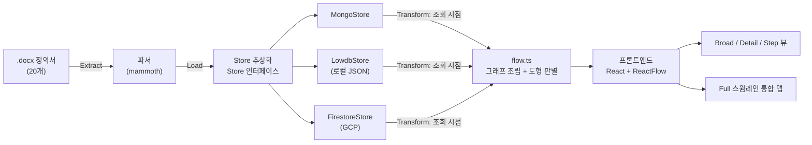

## 들어가며

[1편](/posts/docx-process-flowchart-elt/)에서는 Word 정의서를 업로드하면 사람이 다시 그리지 않아도 표준 플로우차트로 자동 렌더링되는 프로세스 시각화 도구를 어떻게 설계했는지, [2편](/posts/flowchart-swimlane-edge-routing/)에서는 그 그래프를 스윔레인 화면에 실제로 그리면서 부딪힌 문제를 다뤘다. 이번 글은 그 도구를 실제로 접근 가능한 형태로 GCP에 배포하는 과정에서 겪은 사고 기록이다.

이 도구를 만들게 된 이유는 1편에서 썼듯, 프로세스 정의서가 바뀔 때마다 사람이 드로잉 툴을 열어 그림을 처음부터 다시 그려야 했고, 그 사이 원본 문서와 그림 버전이 어긋나는 문제가 반복됐기 때문이다. 로컬 데모(lowdb)만으로도 이 문제는 보여줄 수 있었지만, 팀원들이 각자 접속해서 실시간으로 최신 상태를 볼 수 있게 하려면 실제 배포가 필요했다. 그래서 저장 계층에 GCP Firestore 구현체(`store.firestore.ts`)를 추가하고 Cloud Run 배포 자동화(`make deploy`)를 맞춰뒀는데, 그렇게 배포한 서비스에서 발생한 사고가 이번 글의 주제다.

전날 배포된 서비스에 신규 문서를 업로드했는데, 다음 날 다시 들어가보니 업로드했던 문서도, 변경 이력(history)도 전부 사라져 있었다. 서버 로그도, 배포 스크립트도 특별히 에러를 내지 않은 채 "정상적으로" 동작하고 있었기 때문에 처음엔 원인을 짐작하기 어려웠다.

> 이 글도 1편·2편과 동일한 마스킹 기준을 따른다 — 실제 GCP 프로젝트 ID, 서비스 계정 식별자 등 사내 정보는 담지 않았고 모두 예시 값으로 대체했다.
{: .prompt-warning }

---

## 0. 이 프로젝트를 왜 만들었나 (비즈니스 배경)

이번 사고를 이해하려면 먼저 이 도구가 왜 필요했는지부터 정리하는 게 맞을 것 같다. (자세한 설계는 1편·2편에서 다뤘고, 여기서는 이 글을 이해하는 데 필요한 만큼만 요약한다.)

사내에는 영업 프로세스별 Word 정의서(총 20개)가 이미 있었다. 리드/기회 발생부터 계약 체결·청구·마감까지 이어지는 macro 흐름 7단계, 그리고 그 아래 계약검토·사업성검토 같은 detail 그룹으로 나뉜 구조였다. 문제는 두 가지였다.

1. **문서와 그림이 따로 논다.** 프로세스가 바뀔 때마다 draw.io 같은 툴로 흐름도를 처음부터 다시 그려야 했고, 그 사이 원본 문서와 그림이 서로 다른 버전을 가리키는 일이 반복됐다.
2. **정적 이미지로는 다음 단계 계획을 못 채운다.** 이 흐름도를 신입사원 교육에서 슬랙봇과 연계해 활용할 계획이 있었는데, 이건 "지금 그려놓은 그림"이 아니라 "지금 실제 프로세스 상태를 실시간으로 반영하는" 데이터를 요구했다. 이미지 파일로는 애초에 불가능한 요구사항이었다.

그래서 방향을 "정의서를 업로드하면 사람이 다시 그리지 않아도 자동으로 표준 플로우차트로 렌더링되고, 그 데이터를 API로도 재사용할 수 있는 도구"로 잡았다. 기대한 효과는:

- **정합성**: 재업로드만 하면 그림이 자동 갱신되니 "문서는 고쳤는데 그림은 옛날 버전"인 상태가 사라진다.
- **청중별 해상도**: 경영진 보고엔 전체 흐름(Overview), 실무 인수인계엔 단계별 상세(Step)까지 같은 도구·같은 데이터로 대응한다.
- **확장 기반**: API로 실시간 상태를 조회할 수 있는 구조라, 이후 슬랙봇 연계 등 다른 채널에서도 같은 데이터를 그대로 가져다 쓸 수 있다.

이번 사고의 배경도 여기서 나온다. 로컬 데모(lowdb)만으로는 "실시간으로 여러 사람이 접근 가능"이라는 요구를 채울 수 없어서, 그 요구를 실제로 충족시키려고 GCP에 배포한 것이었다. 그리고 그 배포판에서 "실시간으로 최신 상태를 보여준다"는 약속이 제일 먼저 깨졌다는 게 이 사고의 아이러니다.

## 1. 아키텍처 개요



- **백엔드(ELT)**: `.docx`를 `mammoth`로 파싱해 원본 그대로 저장하고, 그래프 조립·도형 판별 같은 무거운 변환은 저장 시점이 아니라 **조회 시점**에 수행한다(1편). 변환 로직이 바뀌어도 데이터 재적재가 필요 없다는 게 이 설계의 핵심 이점이다.
- **저장소 추상화**: `Store` 인터페이스 하나에 `MongoStore` / `LowdbStore` / `FirestoreStore` 세 구현체를 갈아끼울 수 있게 했다(이번 글의 주인공). 인프라 준비 여부와 무관하게 항상 데모가 가능하도록, 연결 실패 시 lowdb로 자동 폴백하는 안전장치도 넣어뒀다 — 이 안전장치가 이번 사고에서 "장애를 감추는 부작용"으로도 작동했다.
- **도형 자동 판별**: 노드의 진입/진출 차수와 텍스트 키워드만으로 시작/끝(terminator)·판단(decision)·입출력(io)·처리(process) 도형을 자동으로 결정한다. 사람이 일일이 도형을 지정할 필요가 없다.
- **네 가지 드릴다운 뷰**: 같은 원본 데이터를 Broad(전체 macro) → Detail(하위 그룹) → Step(개별 단계) → Full(전체 스윔레인 통합 맵) 네 가지로 조립한다. Full 뷰는 분기·반려·계층 엣지를 화면에 선 대신 "다음 →" 뱃지로 변환해서 내려준다(2편에서 다룬 렌더링 문제의 원인이 여기 있다).
- **레이아웃 편집 + 이력**: 자동 배치가 완벽하지 않은 나머지는 사람이 직접 노드/엣지를 드래그해서 고칠 수 있게 하고, 저장할 때마다 이전 상태를 이력(history)으로 쌓아 되돌릴 수 있게 했다(2편). 이 "이력"이 바로 이번 사고에서 사라진 데이터의 정체이기도 하다.

이 중에서 이번 글이 다루는 부분은 **저장소 추상화 계층을 GCP에 실제로 배포했을 때** 벌어진 일이다.

---

## 2. 증상

- 전날 `.docx` 문서를 업로드해서 정상적으로 처리 완료 메시지까지 받았다.
- 다음 날 같은 배포 URL로 들어가보니 업로드했던 신규 문서, 그리고 업로드/삭제 이력(dashboard history)이 전부 비어 있었다.
- 배포는 Cloud Run(백엔드) + Cloud Run(프론트엔드) + Firestore 조합이고, 배포 파이프라인은 `make deploy`로 자동화되어 있어 배포 자체에는 별다른 실패 로그가 없었다.

---

## 3. 원인 분석

### 2-1. 저장소 추상화 구조

이 프로젝트는 저장 계층이 `Store`라는 인터페이스로 추상화되어 있고, 환경변수 `STORE_DRIVER`로 실제 구현체(Firestore / MongoDB / lowdb)를 선택하도록 설계되어 있었다.

```ts
// db.ts
function resolveDriver(): Driver {
  const explicit = process.env.STORE_DRIVER?.trim().toLowerCase();
  if (explicit === "firestore" || explicit === "mongo" || explicit === "lowdb") {
    return explicit;
  }
  if (process.env.MONGODB_URI?.trim()) return "mongo";
  return "lowdb";
}
```

핵심은 `initStore()`의 폴백 로직이었다.

```ts
export async function initStore(): Promise<Store> {
  let store = getStore();
  try {
    await store.connect();
  } catch (err) {
    if (store.kind === "mongo" || store.kind === "firestore") {
      console.warn(`[store] ⚠ ${store.kind} 연결 실패 → lowdb 로 폴백합니다.`);
      _store = new LowdbStore();
      store = _store;
      await store.connect();
    } else {
      throw err;
    }
  }
  return store;
}
```

Firestore/Mongo 연결에 실패하면 "데모가 죽지 않도록" 자동으로 `lowdb`(컨테이너 로컬 JSON 파일)로 조용히 폴백하는 안전장치였다. 문제는 이 폴백이 **에러를 서버 콘솔 로그에만 남기고, API 응답이나 화면상으로는 전혀 티가 나지 않는다**는 점이었다. 업로드는 매번 200 OK로 정상 응답했고, 화면에도 업로드된 문서가 바로 보였다 — 다만 그 저장소가 Firestore가 아니라 컨테이너 로컬 파일이었을 뿐이다.

### 2-2. 헬스체크로 확인

```
curl https://<backend-url>/api/health
```

```json
{"status":"ok","storage":"lowdb","counts":{"processes":20, ...}}
```

`storage` 필드가 `firestore`가 아니라 `lowdb`로 나왔다. 원래 이 서비스는 Firestore를 쓰도록 배포되어 있었으므로, 이 시점에 이미 "뭔가 연결에 실패해서 폴백된 상태"라는 게 확인됐다.

### 2-3. 로그로 근본 원인 확인

Cloud Logging에서 해당 리비전의 부팅 로그를 확인했다.

```
[store] ⚠ firestore 연결 실패 → lowdb 로 폴백합니다.
        원인: 7 PERMISSION_DENIED: Missing or insufficient permissions.
        확인: FIRESTORE_PROJECT_ID=my-gcp-project, FIRESTORE_DATABASE_ID=my-firestore-db
[store] 저장소 준비 완료 (kind=lowdb)
```

`PERMISSION_DENIED`였다. Cloud Run 서비스는 기본 Compute Engine 서비스 계정(`<PROJECT_NUMBER>-compute@developer.gserviceaccount.com`)으로 실행되고 있었는데, 이 계정의 IAM 역할을 확인해보니 `roles/datastore.user`(Firestore 접근 권한)가 없었다.

```
$ gcloud projects get-iam-policy my-gcp-project \
    --flatten="bindings[].members" \
    --filter="bindings.members:<PROJECT_NUMBER>-compute@developer.gserviceaccount.com" \
    --format="table(bindings.role)"

ROLE
roles/bigquery.admin
roles/storage.objectUser
...
(datastore.user 없음)
```

### 2-4. 왜 배포를 여러 번 했는데도 안 걸렸나

배포는 Makefile로 자동화되어 있었다.

```
make deploy-backend GCP_PROJECT=my-gcp-project
```

이 타깃은 `STORE_DRIVER=firestore`, `FIRESTORE_PROJECT_ID`, `FIRESTORE_DATABASE_ID` 같은 **환경변수 주입까지만** 자동화되어 있었고, **서비스 계정에 IAM 권한을 부여하는 단계는 의도적으로 자동화 대상에서 빠져 있었다.** 배포 문서에도 이렇게 명시되어 있었다.

> Firestore 데이터베이스 생성과 서비스 계정 IAM 권한 부여는 프로젝트 정책과 관련되어 Makefile 에 자동화하지 않았습니다. 아래 수동 절차를 따르세요.

즉 최초 배포 시점에 이 수동 단계(IAM 권한 부여)가 누락된 채로, 이후로는 `make deploy`만 반복 실행해왔던 것이었다. 그래서 몇 번을 다시 배포해도 같은 문제가 반복됐다.

### 2-5. 컨테이너 로컬 저장소가 비영속인 이유

lowdb는 컨테이너 파일시스템의 JSON 파일에 쓴다.

```ts
// store.lowdb.ts
const DB_FILE = path.join(DATA_DIR, "db.json");
```

Cloud Run 컨테이너는 스케일-투-제로, 새 리비전 배포, 인스턴스 교체 등으로 언제든 새 컨테이너가 뜰 수 있는 **비영속(ephemeral) 파일시스템**이다. 전날 업로드 당시엔 화면상 정상 동작했지만, 실제로는 그 컨테이너 로컬 파일에만 저장돼 있었고, 밤사이 인스턴스가 재시작되며 그 파일과 함께 데이터가 통째로 사라진 것이었다.

---

## 4. 조치

- IAM 권한(`roles/datastore.user`) 부여는 프로젝트 공유 인프라에 대한 변경이라 임의로 실행하지 않고, 팀 내 승인을 받는 절차를 진행 중이다.
- 권한이 부여되면 별도 재배포 없이도(기존 리비전이 재시작되는 시점부터) 정상적으로 Firestore에 연결될 것으로 예상된다.
- 유실된 업로드 데이터는 Firestore가 아닌 컨테이너 로컬 파일에만 있었기 때문에 복구 대상이 없다 — 재업로드가 필요하다.

---

## 5. 앞으로의 원칙

- **"조용한 폴백"은 장애를 감춘다.** 연결 실패 시 자동으로 다른 저장소로 넘어가는 안전장치 자체는 나쁘지 않지만, 그 사실이 API 응답이나 화면 어디에도 드러나지 않으면 "정상 동작처럼 보이는 장애"가 된다. 최소한 폴백이 발생하면 헬스체크나 관리자 화면에 경고 배지 정도는 노출하는 게 맞다고 본다.
- **배포 자동화와 권한 설정은 분리되기 쉽다.** 배포 스크립트가 매번 성공(exit 0)한다고 해서 그 배포가 "의도한 상태"라는 보장은 없다. 환경변수 주입까지는 자동화됐지만 그 환경변수가 실제로 동작하기 위한 전제 조건(IAM 권한)은 사람이 한 번은 수동으로 챙겨야 하는 단계였고, 그 단계가 빠진 채로 반복 배포되고 있었다.
- 배포 후에는 `/api/health` 같은 엔드포인트로 "설정한 대로 실제로 붙었는지"를 확인하는 습관을 들이기로 했다.

---

## 마치며

배포 스크립트가 에러 없이 끝났다고 해서 "의도한 저장소에 잘 붙었다"는 뜻은 아니었다. 이번 일로, 인프라를 추상화해서 장애에 자동으로 대응하게 만드는 설계와, 그 자동 대응이 발생했다는 사실 자체를 눈에 띄게 만드는 설계는 별개의 문제라는 걸 배웠다.
