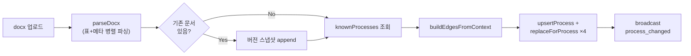

[1편](/posts/docx-process-flowchart-elt/)~[3편](/posts/process-panel-pain-point-priority/)에서 다룬 프로세스 시각화 도구는 처음엔 업로드해도 메타필드(목적·범위·종료조건·작성자·버전)만 갱신되고, 정작 화면에 그려지는 단계(steps)·Pain Point·연결(edges)은 시드 데이터 그대로였다. 이번 글은 그 한계를 없애면서 부딪힌 네 가지 요구사항 — 부분 갱신, 실시간 동기화, 버전 이력, 레이아웃까지 포함한 버전 관리 — 을 어떻게 구현했는지 다룬다.

> 이 글에도 실제 회사명, 문서 식별자는 담지 않았다. 문서 코드는 예시로 P1/P2/P3처럼 일반화했고, 실제 프로세스 이름이 아니다.
{: .prompt-warning }

---

## 요구사항 네 가지

1. 문서 하나(예: P2)만 재업로드해도 그 프로세스의 단계/이슈/연결까지 통째로 갱신되어야 하고, 다른 프로세스(P1, P3 등)는 건드리지 않아야 한다.
2. 다른 브라우저 탭/사용자도 업로드 즉시 대시보드가 갱신되어야 한다 — 기존엔 업로드한 본인 탭만 즉시 반영됐다.
3. 버전 이력을 프로세스별로 묶어서 전/후 비교하며 볼 수 있어야 한다. `process_versions` 컬렉션과 조회 API는 이미 있었지만 스냅샷 범위가 메타필드뿐이었고 프론트 UI가 아예 없었다.
4. 레이아웃(수동으로 옮긴 노드 위치·엣지 선)도 버전 이력에 포함되어야 한다. 뷰 단위 레이아웃 이력과 프로세스 버전이 완전히 분리돼 있어 "이 프로세스가 이 버전이었을 때 화면이 어땠는지"를 볼 수 없었다.

---

## 1. docx 표 파싱 확장

기존엔 `mammoth.extractRawText`로 뽑은 평문에서 라벨 뒤 텍스트만 매핑했다. 표로 작성된 단계·RACI·Pain Point는 손대지 못했다. `mammoth.convertToHtml`을 `extractRawText`와 병렬로(`Promise.all`) 호출하고, HTML 파싱에 **cheerio**를 새로 추가해 표 구조를 걷어냈다.

실제 문서(P3·D-계열 두 개)에 직접 변환을 돌려 확인한 특성이 파싱 규칙에 그대로 반영됐다.

- 모든 표가 `<thead>` 안에 `<tr><th>`로만 렌더링되고 `<tbody>`가 없다 → 첫 `<tr>`을 헤더, 나머지를 데이터 행으로 취급해야 한다.
- 셀 안에 `<p>`가 여러 개일 수 있다 → `" / "`로 join하고 각 문단의 `-` 불릿 접두어를 제거한다.
- Pain Point 표 뒤에 안내용 "Scale Guide" 행과 완전 공백 템플릿 행이 여러 개 있다 → 번호 칸이 숫자로 안 읽히거나 설명 칸이 비어 있으면 그 행은 버린다. 원문 보존 원칙(1편에서 다룬)에 따라 빈 행을 억지로 레코드화하지 않는다.
- Context 표의 "다음 프로세스" 칸은 분기 시 OR로 구분된 여러 블록을 가진다(예: 한 프로세스가 세 갈래로 분기).

새로 추가한 파서 함수들은 역할이 뚜렷하게 나뉜다.

| 함수 | 역할 |
|---|---|
| `findTable($, mustContainAllHeaders)` | 헤더 매칭으로 표를 찾아 셀 텍스트 2차원 배열 반환 |
| `parseStepsTable` | 빈/템플릿 행을 스킵하며 `StepDoc[]` 생성 |
| `parseRaciTable` | step 이름으로 매칭해 `step.raci` 채움(중복 행은 첫 매칭만 채택) |
| `parsePainPointsTable` | `PainPointDoc[]` 생성 |
| `parseContextTable` | 이전/다음 프로세스 참조, OR 분기 블록 분리, 담당 시스템·이해관계자·Lead Time까지 같은 표에서 함께 추출 |

`buildEdgesFromContext`는 DB 조회가 필요해 파서 밖(`index.ts`)에서 호출한다. 이전=다음이면 rollback, 다음이 2개 이상이면 branch(①②③ 라벨), 그 외엔 sequence로 판별한다. 이름만 있고 ID 접두어가 없는 참조는 기존 프로세스 목록과 이름 매칭을 시도하고, 실패하면 추측해서 채우는 대신 `DataQualityFlagDoc`으로 남긴다.

**핵심 제약 하나** — 이 문서가 *발신하는*(`from = processId`) 엣지만 새로 만든다. 그래야 "P2만 재업로드해도 P1·P3는 안 건드림"이 성립한다. 부작용도 있다: 업스트림 문서가 아직 한 번도 파싱되지 않았으면 인바운드 엣지가 없어 화면상 시작 노드처럼 보일 수 있다 — 알고 있는 채로 허용한 트레이드오프다.

---

## 2. 범위 한정 업데이트 — `replaceForProcess`

`Store` 인터페이스에 메서드를 하나 추가했다.

```ts
replaceForProcess<T extends AnyDoc>(
  collection: CollectionName,
  query: Partial<Record<string, unknown>>,
  docs: T[]
): Promise<void>;
```

lowdb 구현은 기존 `matches()` 헬퍼로 query에 걸리지 않는 것만 남기고 새 docs를 이어붙인다. Mongo/Firestore 구현은 `deleteMany(query) + insertMany(docs)` 패턴이다(기존 `replaceAll`과 동일한 삭제-재삽입 패턴이되, 범위만 좁힌 것 — [Firestore 구현체](/posts/store-firestore-deepdive/)에서 다룬 `replaceAll`의 청크 배치 삭제/삽입 로직을 그대로 재사용한다).

업로드 오케스트레이션(`POST /api/upload`)은 이렇게 정리된다.



삭제(`DELETE /api/process/:id`)도 같은 원칙으로 고쳤다 — `deleteProcess` 외에 `replaceForProcess`로 steps/pain_points/edges(from=id)를 빈 배열로 교체해 고아 데이터를 정리하고, `process_changed` 대신 `process_deleted`를 방송한다.

---

## 3. 버전 이력 — 프로세스 단위

기존 스냅샷은 `ProcessDoc` 하나만 담았다. 이제 그 프로세스의 steps·pain_points·edges·레이아웃까지 함께 묶는다.

```ts
export interface ProcessVersionSnapshot {
  process: ProcessDoc;
  steps: StepDoc[];
  pain_points: PainPointDoc[];
  edges: EdgeDoc[];       // 이 프로세스의 아웃바운드 엣지
  layout: { edges?: Record<string, unknown>; nodes?: Record<string, unknown> } | null;
}
export interface ProcessVersionDoc {
  _id: string;
  process_id: string;
  doc_version: string;
  snapshot: ProcessVersionSnapshot;
  saved_at: string;
}
```

업로드로 **덮어써지기 직전**에 이 스냅샷을 append한다(교체 없음, 계속 누적). 레이아웃-버전 연결 규칙은 하나로 좁혔다 — `steps:{process_id}` 뷰의 레이아웃만 버전 스냅샷에 포함한다. 전체 통합 뷰나 그룹 뷰는 여러 프로세스가 섞여 있어 단일 프로세스 소유가 아니므로 범위 밖으로 뒀고, 뷰 공용 레이아웃 이력([2편](/posts/flowchart-swimlane-edge-routing/)에서 다룬 되돌리기 기능)은 그대로 별도로 유지된다.

프론트 상세 패널에 "이력" 탭을 추가했다. 버전 목록(최신순)에서 하나를 선택하면 그 시점의 단계·Pain Point 카드를 읽기 전용으로 렌더링한다(기존 `StepCard` 재사용, Pain Point 카드는 "이슈" 탭에 있던 인라인 JSX를 `PainPointCard`로 추출해 공용화). 레이아웃은 그래프로 재렌더링하지 않고 요약(노드 위치 N개·엣지 편집 M개) + "이 레이아웃으로 복원" 버튼으로 제공한다. `FlowCanvas`를 과거 스냅샷용으로 억지로 재사용하면 현재 뷰의 편집 상태와 충돌할 위험이 커서, 복원은 현재 `steps:{id}` 레이아웃 슬롯만 교체하는 걸로 범위를 좁혔다.

---

## 4. 버전 이력 — 대시보드 전체 스냅샷

프로세스별 이력만으로는 "그때 전체 아키텍처 화면이 어떻게 생겼었는지"는 알 수 없다. 그래서 업로드·삭제가 성공할 때마다 그 순간의 전체 상태 — 전체 프로세스, steps, pain_points, edges, hierarchy, 그리고 모든 뷰(전체/그룹/단계)의 레이아웃까지 — 를 통째로 `DashboardVersionDoc`에 append한다.

이 스냅샷을 통째로 문서 하나에 넣는 게 걱정이었는데, 실측해보니 스냅샷 하나의 크기가 **82.9KB** — Firestore 문서당 한도(1MiB)의 8% 수준이라 여유가 충분했다.

이 기능이 예상보다 쉽게 붙은 이유가 있다. 그래프 빌더(`buildFullGraph`/`buildDetailGraph`/`buildStepGraph`, [1편](/posts/docx-process-flowchart-elt/)에서 다룬 순수 함수들)가 라이브 DB 조회 결과든 과거 스냅샷 배열이든 **입력 형태만 같으면 그대로 받아들인다.** 그 덕에 과거 시점의 그래프를 재구성하는 API(`/api/dashboard-versions/:id/flow/*`)는 새 로직 없이 스냅샷 데이터를 그대로 같은 빌더에 넘기는 것만으로 완성됐다.

목록 API는 스냅샷 본문(용량 큰 부분)을 빼고 메타데이터만 내려준다 — 목록 화면을 가볍게 유지하기 위해서다.

| Method | Path | 비고 |
|---|---|---|
| GET | `/api/dashboard-versions` | 목록(메타데이터만, 본문 제외) |
| GET | `/api/dashboard-versions/:id/layout` | 그 시점 전체 뷰 레이아웃 |
| GET | `/api/dashboard-versions/:id/flow/full` | 전체 통합 뷰 재구성 |
| GET | `/api/dashboard-versions/:id/flow/detail/:macroId` | 그룹 뷰 재구성 |
| GET | `/api/dashboard-versions/:id/flow/steps/:processId` | 단계 뷰 재구성 |

프론트에는 `HistoryManager.tsx`를 새로 만들어 대시보드 버전 목록을 보여주고, 과거 버전을 선택하면 `FlowCanvas`가 읽기 전용(readOnly) 모드로 그 시점 그래프를 그린다.

---

## 5. 실시간 동기화 — SSE

편도(서버→클라이언트) 통신만 필요해서 WebSocket 대신 별도 의존성 없는 **Server-Sent Events**를 택했다.

백엔드는 `GET /api/events`로 `text/event-stream` 연결을 유지하고, 연결된 클라이언트를 `Set<Response>`로 관리한다. 업로드·삭제가 성공할 때마다 `broadcast({ type: "process_changed", process_id })`를 호출해 연결된 모든 탭에 방송하고, 25초 하트비트로 연결이 끊기지 않게 한다.

```ts
function broadcast(event: { type: string; process_id?: string }): void {
  const payload = `data: ${JSON.stringify(event)}\n\n`;
  for (const client of sseClients) client.write(payload);
}
```

프론트는 `useServerEvents` 훅으로 구독한다. 뷰를 옮길 때마다 재구독하지 않도록 앱 수명 전체에서 한 번만 연결하고, 현재 보고 있는 뷰는 `ref`로 참조해 최신 값을 읽는다. 이벤트를 받으면 기존 `loadGraph(viewRef.current)`를 그대로 재호출해 지금 화면을 다시 조회하고, `refreshKey`를 증가시켜 업로드/이력 패널도 함께 새로고침되게 했다. 다른 사람이 올린 문서가 새로고침 없이 반영되는 이유가 이 구조다.

---

## 검증

- 문서 하나(P2)만 재업로드 후 P1·P3의 steps/edges가 API 응답 그대로인지 확인
- 브라우저 탭 2개를 띄우고 한쪽에서 업로드 → 다른 쪽이 새로고침 없이 그래프가 갱신되는지 확인
- 같은 프로세스를 2번 업로드 후 "이력" 탭에서 버전 2개가 다르게 보이는지, "복원" 버튼이 실제로 레이아웃을 되돌리는지 확인
- 삭제 후 해당 프로세스의 steps/pain_points/edges가 고아로 남지 않는지 확인
- 실제 표 파싱 결과를 시드 데이터와 대조하다 분기/롤백 판별, 빈 셀 null 처리 버그 2건을 발견해 수정
- 백엔드/프론트 타입체크·빌드 통과 확인

## 파일 변경 규모

새 기능치고 변경 폭이 꽤 컸다 — 파일 19개, +2054/−224줄. 신규 파일(`HistoryManager.tsx`, `VersionCards.tsx`, `Cards.tsx`, `useServerEvents.ts`, `versionUtils.ts`)이 5개, 기존 파일 중에서는 `parser.ts`(+362/−29)와 `App.tsx`(+258/−62)가 가장 많이 바뀌었다.

---

## 마치며

네 가지 요구사항이 따로 노는 것 같았는데, 구현하다 보니 서로를 지지대 삼고 있었다. 범위 한정 업데이트(`replaceForProcess`)가 없었다면 버전 스냅샷도 "이 프로세스만의 변화"를 정확히 담지 못했을 거고, 그래프 빌더가 순수 함수가 아니었다면 대시보드 전체 스냅샷에서 과거 시점을 재구성하는 API는 훨씬 더 많은 코드가 필요했을 것이다. 처음부터 완벽하게 설계했다기보다, 앞서 만들어둔 구조(범위 한정 저장, 순수 함수 그래프 빌더)가 나중 요구사항을 더 쉽게 만들어준 경험이었다.
