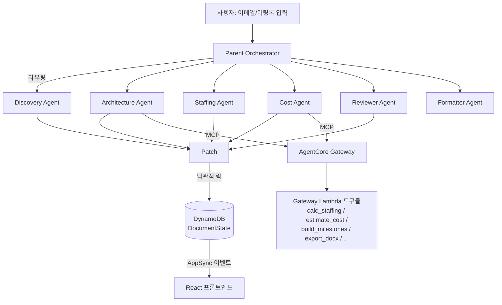

[Megathon 2026 사전교육](/posts/megathon-2026-ai-agent-core-concepts/)에서 배운 Strands Agent SDK와 Amazon Bedrock AgentCore 개념을, 실제 해커톤(Team 37)에서 팀으로 구현해본 프로젝트가 **MZC SpaceFlow**다. AWS 파트너사 영업·기술 담당자가 PoA(Proof of Authority) 문서를 쓰는 데 평균 5일(Reject 포함 8일)이 걸리던 걸, 이메일·미팅록 같은 비정형 자료를 넣으면 자율 에이전트가 초안을 만들어주는 방식으로 줄여보자는 게 목표였다. 나는 이 프로젝트에서 요건 정의·기획·UX 설계(OPS) 쪽을 맡았고, 에이전트/백엔드 구현은 CTU Engineering 트랙 팀원들이 맡았다.

이 글은 팀이 함께 만든 결과물이지만, 해커톤이 끝난 뒤 리포지토리 코드를 내가 직접 다시 훑어보며 "실제로 어떻게 짜여 있었는지"를 정리한 것에 가깝다. 그래서 아래 아키텍처 설명과 "발견한 이슈들" 섹션은 내가 만들 때 겪은 체감이 아니라, 코드를 근거로 한 사후 분석이다.

> 리포지토리는 이미 공개돼 있다: [github.com/i-am-U-hyUn/MZC_Space_Flow](https://github.com/i-am-U-hyUn/MZC_Space_Flow). 이 글은 그 코드를 그대로 설명하는 글이라 별도 마스킹은 하지 않았다.
{: .prompt-info }

---

## 1. 무엇을, 왜

| 항목 | 현재 |
|---|---|
| 1건 평균 작성 시간 | 5일 |
| Reject 포함 실질 | 8일 |
| 연간 Reject율 | 30% (54건 중 16건) |
| 연간 누적 공수 | 약 318일 |

PoA는 AWS 파트너 펀딩을 받기 위해 제출하는 문서라, 형식과 근거가 까다롭고 반려되면 처음부터 다시 손대야 하는 일이 잦았다. 이 병목을 세 단계(비정형 자료 → 구조화 → 초안 → QA/QC → 승인)로 쪼개서 각 단계를 전담 에이전트에게 맡기면, 사람은 검토·승인만 하면 되는 구조를 만들 수 있겠다고 봤다.

## 2. 아키텍처

**Parent Orchestrator**가 전체 흐름의 중심이다. 매 턴마다 AgentCore Memory에서 세션 맥락을, DynamoDB에서 현재 `DocumentState`와 버전을 가져온 뒤, 라우터가 어떤 작업을 어떤 서브 에이전트에게 보낼지 `TaskPlan`을 만들고, 서브 에이전트들의 결과를 모아 `Patch`로 변환해 DynamoDB에 쓰고 AppSync로 프론트에 뿌린다.

라우팅은 2단계다. 입력이 300자 이하로 짧고 "리뷰해줘", "비용 계산해줘" 같은 고신호 키워드가 있으면 규칙 기반으로 즉시 매칭하고, 그보다 길고 애매한 입력은 Claude 3.5 Sonnet에게 에이전트 레지스트리(`agent_registry.json`) 전체를 시스템 프롬프트로 주고 라우팅을 맡긴다. 다만 LLM이 레지스트리에 없는 에이전트 이름(`review_agent` 등)을 지어내는 경우가 실제로 있어서, 응답으로 온 에이전트 이름을 화이트리스트로 검증하고 걸러내는 방어 코드가 붙어 있다.

**서브 에이전트 6종**은 역할이 뚜렷하게 나뉜다.

- **Discovery**: 이메일·미팅록 원문을 Claude에 넣어 고객사·요구사항·기술스택·예산·일정 등을 고정 JSON 스키마로 뽑아낸다. 초안 생성을 막는 필수 필드(`draft_required`)와, DOCX 내보내기 시점에만 확인하는 필드(`export_required`)를 나눠서, 입력 한 번에 질문이 쏟아지지 않게 했다.
- **Architecture**: 기존 `.drawio` XML을 분석하거나 텍스트에서 새로 아키텍처를 설계한다. LLM이 서비스 목록에서 Amazon Bedrock을 빠뜨리면 강제로 추가하는 후처리가 있는데, Bedrock 포함이 펀딩 자격 요건이라서다.
- **Staffing**: LLM보다는 프리셋(`project_type_rules.json` → `staffing_presets.json` → `rate_card.json`) 기반 결정론적 로직이 핵심이다. 프로젝트 유형을 키워드로 감지하고, 역할별 공수/단가 템플릿을 채운 뒤 요율이 범위를 벗어나면 위반으로 표시한다.
- **Cost**: 인건비는 결정론적으로 계산하고, AWS 비용은 Gateway를 통해 외부 계산기 도구를 호출한다.
- **Reviewer**: 필수 섹션 존재 여부, 총 비용 > 0 같은 체크리스트 검증에 더해, 펀딩 프로그램(GenAIIC PLD) 전용 규칙 검증(`FundingValidator`)을 더한다.
- **Formatter**: 완성된 섹션들을 APN 문서 순서로 정렬해 DOCX 내보내기를 호출하는 얇은 레이어다.

## 3. 핵심 로직 두 가지

**Patch 기반 상태 동기화.** 모든 서브 에이전트의 결과물은 `Patch`(op/path/value + 이 값이 사용자 입력인지/AI 추천인지/계산값인지 표시하는 source)로 변환된다. 문서의 모든 편집 가능한 필드는 `{user_input, ai_recommended, calculated, status, user_edited}` 4개 속성을 갖고, `user_input > ai_recommended > calculated` 우선순위로 값이 결정된다. 이 덕분에 "AI가 추천한 값"과 "사람이 직접 고친 값"이 같은 필드 안에서 출처를 잃지 않고 공존하고, DynamoDB 낙관적 락(버전 조건부 쓰기)으로 동시 수정 충돌도 막는다. 프론트엔드는 AppSync Events로 이 patch를 구독해서, 백엔드와 완전히 같은 JSON-Pointer 방식으로 로컬 상태에 그대로 적용한다.

**Approve/Reject Change Request.** 오케스트레이터가 patch를 항상 바로 적용하는 건 아니다. 권한이 없는 사용자의 변경은 즉시 반영하는 대신 같은 patch를 "Change Request"로 쌓아두고, 프론트에서 AS-IS/TO-BE diff로 보여준 뒤 승인해야 반영되게 했다. 즉 권한 게이팅이 별도 로직이 아니라, 어디서나 쓰는 Patch라는 동일한 단위 위에 얹힌 구조다.

DOCX 내보내기(`export_docx.py`)도 눈에 띄는 부분인데, `docxtpl`(Jinja 템플릿)만으로는 중첩된 글머리 기호 목록이나 역할 수에 따라 컬럼이 달라지는 표를 만들 수 없어서, 렌더링된 `.docx` 안의 `document.xml`을 직접 열어 `xml.etree.ElementTree`로 후처리하는 방식을 썼다.

## 4. 코드를 다시 보며 발견한 것들

해커톤이 끝난 뒤 코드를 다시 들여다보니, 시간 압박 속에서 흔히 나오는 흔적들이 몇 가지 남아 있었다.

**v1 → v2 스키마 마이그레이션이 완전히 끝나지 않았다.** `document_state.py`를 보면 v1에 있던 `reason/source_patterns/confidence` 메타데이터와 `recommended` 상태, 최상위 `staffing_plan`/`client_signatures` 섹션이 v2에서 제거·통합됐다. 테스트(`test_agent_patch_paths_v2.py`, `test_funding_v2.py` 등)는 이 마이그레이션을 꼼꼼하게 검증하고 있는데, 정작 `formatter/milestone_sync.py`나 `cost_agent.py::calculate_default_contribution` 같은 일부 모듈은 여전히 삭제된 v1 필드(`staffing_plan`, `FieldStatus.recommended`)를 참조하고 있었다. 실행 경로상 호출되지 않는 죽은 코드라 문제를 일으키진 않았지만, 실제로 호출됐다면 `AttributeError`가 났을 것이다. 오케스트레이터의 실제 마일스톤 동기화는 `milestone_sync.py`가 아니라 `orchestrator.py` 안에 별도로 다시 구현된 `_trigger_milestone_sync()`가 맡고 있었다 — 마이그레이션 중 "호출부는 고치고 예전 모듈은 그대로 남겨두는" 전형적인 패턴이다.

**Gateway Lambda 계약 불일치.** 오케스트레이터는 마일스톤 요약 도구(`build_milestones.py`)를 호출할 때 `resources_cost_estimates`(v2 이름)로 파라미터를 보내는데, 정작 Lambda 쪽 코드는 여전히 `params.get("staffing_plan", {})`(v1 이름)를 찾는다. 이 도구가 실제로 연결돼 호출됐다면 항상 빈 값을 받아 0시간짜리 결과를 조용히 반환했을 것이다 — 에러가 나지 않아서 데모 중에는 눈치채기 어려운 유형의 버그다.

**프론트엔드 크래시와 로컬 개발 우회.** 해커톤 이후 유일한 커밋(8/31, `7d7d712`)이 이 문제를 고친 것이었다. `amazon-cognito-identity-js`가 Node의 전역 객체 `global`을 참조하는데, Vite는 브라우저 번들에서 이를 기본으로 폴리필하지 않아 앱이 뜨자마자 `ReferenceError: global is not defined`로 죽는 문제였다. `vite.config.ts`에 `define: { global: 'globalThis' }` 한 줄을 추가해 해결했고, 같은 커밋에 배포된 Cognito 없이도 로컬에서 화면을 볼 수 있는 `VITE_DEV_BYPASS_AUTH` 플래그도 함께 넣었다 — "배포된 내 환경에서는 되는데 새로 클론하면 안 되는" 전형적인 사례.

**Bedrock 추론 프로파일 fallback.** `InferenceProfileFallback`은 기본 추론 프로파일 호출이 실패하면 다른 프로파일로 재시도하고, 그것도 실패하면 "성능 저하 모드"로 넘어가 프론트에 상태를 알리는 로직이다. 이런 코드가 테스트까지 갖춰져 있다는 건, 해커톤 중 실제로 Bedrock 추론 프로파일이 스로틀링되거나 일시적으로 못 쓰는 상황을 겪었다는 뜻으로 읽힌다.

## 5. 마치며

내 쪽 역할은 요건 정의·기획·UX였고, 실제 엔지니어링은 CTU Engineering 팀원들이 짰다. 이번에 코드 레벨까지 다시 훑어보면서 라우팅 화이트리스트, patch 기반 낙관적 락, fallback 카드 같은 설계와, v1→v2 마이그레이션 잔재·Gateway 계약 불일치 같은 흔적을 같이 확인했다.
